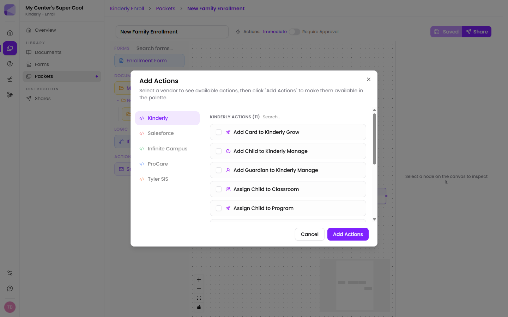

Actions are automation blocks you drop onto a [packet](/packets/overview/) canvas. When a family completes the step an action is connected to, the action runs.

Used well, this is what turns a signed enrollment packet into a fully created child record — without anyone retyping a name.

## Adding actions to your palette

**Send Email** is available by default. The rest are opt-in: click the **+** beside **Actions** in the packet palette, pick a vendor, choose the actions you want, and **Add Actions** makes them available to drag onto the canvas.

:::tip[Add only what this packet needs]
The palette is per-packet. Adding all eleven to a packet that only sends a confirmation email just makes the list harder to read.
:::

## The Kinderly actions

**Communication**

| Action | What it does |
|---|---|
| **Send Email** | Sends an email to a parent, a staff member, or anyone else |

**Creating records in [Manage](/manage/overview/)**

| Action | What it does |
|---|---|
| **Add Child to Kinderly Manage** | Creates the child record from the form answers |
| **Add Guardian to Kinderly Manage** | Creates the guardian record |
| **Assign Child to Classroom** | Puts the child in a [classroom](/manage/classrooms/) |
| **Assign Child to Program** | Enrols the child in a [program](/manage/programs/), which starts billing |
| **Add Address to Child / Guardian / Staff** | Attaches an address to the right record |

**Linking the paperwork**

| Action | What it does |
|---|---|
| **Link Share to Child / Guardian / Staff** | Attaches the completed [share](/shares/overview/) to the record, so the signed paperwork lives on the child's file |

**[Grow](/grow/overview/)**

| Action | What it does |
|---|---|
| **Add Card to Kinderly Grow** | Creates a [pipeline](/grow/pipeline/) card, with optional tasks and a default assignee |

## What this makes possible

Chain them and a completed enrollment packet can, on its own:

1. Create the child record
2. Create both guardians
3. Add the family's address to each
4. Assign the child to a classroom
5. Enrol them in a program, starting billing
6. Attach the signed packet to the child's file
7. Email the family a welcome note

That's the whole of enrollment admin, done from data the family typed once.

:::tip[This is the highest-value thing in Kinderly, and the least obvious]
Most centres use packets to collect signatures and then key the answers into Manage by hand — which is the error-prone part, and the part that takes the afternoon. Wiring up these actions once removes that step permanently.
:::

:::caution[Test on yourself before pointing it at families]
Record-creating actions write real data into Manage. Send the packet to your own email first, complete it, and check what appears — including that names and dates landed in the right fields. A misbound field creates a hundred wrong records much faster than a person could.
:::

## When actions run

Controlled by the packet's **Actions** setting — **Immediate** or **Require Approval**. For anything creating records or starting billing, use Require Approval. See [Approval mode](/packets/approval-mode/).

## Next

- [Parameter binding](/actions/parameter-binding/) — feeding answers into actions.
- [Execution](/actions/execution/) — what happens when one runs.
