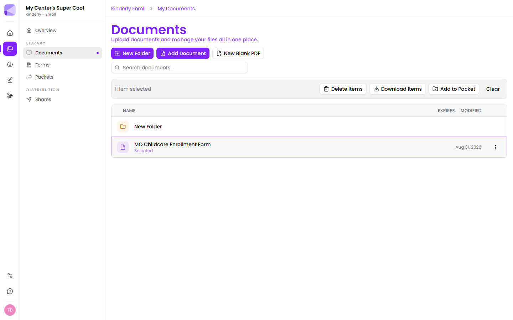
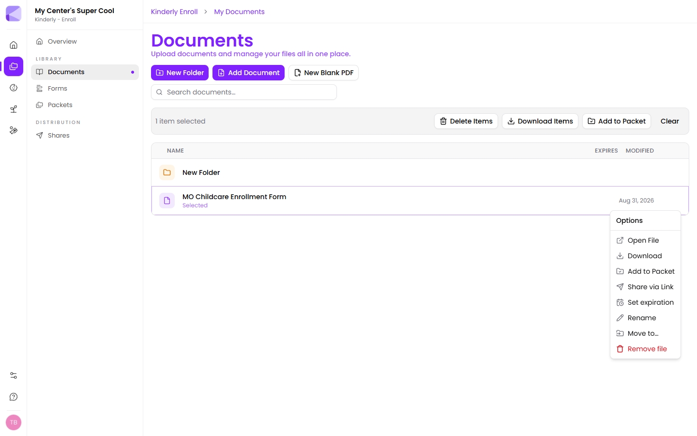

## Uploading

**Add Document**, or drag files straight onto the library. To upload into a folder, open the folder first — files land wherever you currently are.

## Folders

**New Folder** creates one. Click a folder to open it; the breadcrumb at the top shows where you are and gets you back.

## Working with a file

Click a file to select it. A bar appears with actions that work on everything you've selected:

- **Delete Items**
- **Download Items**
- **Add to Packet** — drop straight into a packet without going to the packet builder
- **Clear** — deselect

For actions on a single file, use the **⋮** menu at the end of its row:

| Option | What it does |
|---|---|
| **Open File** | Opens the [viewer](/documents/viewer/) |
| **Download** | Saves a copy to your computer |
| **Add to Packet** | Adds it to a packet as a step |
| **Share via Link** | Sends it to a family on its own — see [Sending a share](/shares/sending/) |
| **Set expiration** | Gives the document an expiry date |
| **Rename** | Changes the filename |
| **Move to…** | Moves it to another folder |
| **Remove file** | Deletes it |

:::tip[Add to Packet from here saves a round trip]
If you're already looking at the document you want to include, adding it to a packet from this menu is quicker than opening the packet builder and hunting for it in the palette.
:::

## Expiry dates

**Set expiration** marks when a document stops being current. The date shows in the **Expires** column of the library.

This is about *your* copy going stale — not about cutting off access to a share. It's for the paperwork that has a shelf life:

- Insurance certificates
- Staff background checks and clearances
- Licensing certificates
- Immunisation records

:::tip[Expiry dates turn your library into a renewal reminder]
Set an expiry on every certificate that has a renewal date and the Expires column becomes a to-do list. Without it, an expired insurance certificate looks exactly like a current one.
:::

:::caution[Two different kinds of expiry]
A **document** expiry (here) flags that your file is out of date. A **[share](/shares/sending/)** expiry stops a family's link working. Setting one doesn't set the other.
:::

## Searching

The search box filters by filename. Worth keeping in mind when naming things — "2026 Enrollment Form" is findable, "scan_0043.pdf" isn't.

## Deleting

Deleting removes the file from your library.

:::caution[Check for packets first]
If a document is a step in a packet, deleting it breaks that step. Before removing anything, make sure it isn't part of a packet you still send.
:::

## Next

- [The document viewer](/documents/viewer/) — adding fields and signing.
- [Packets](/packets/building-a-packet/) — using documents as steps.
