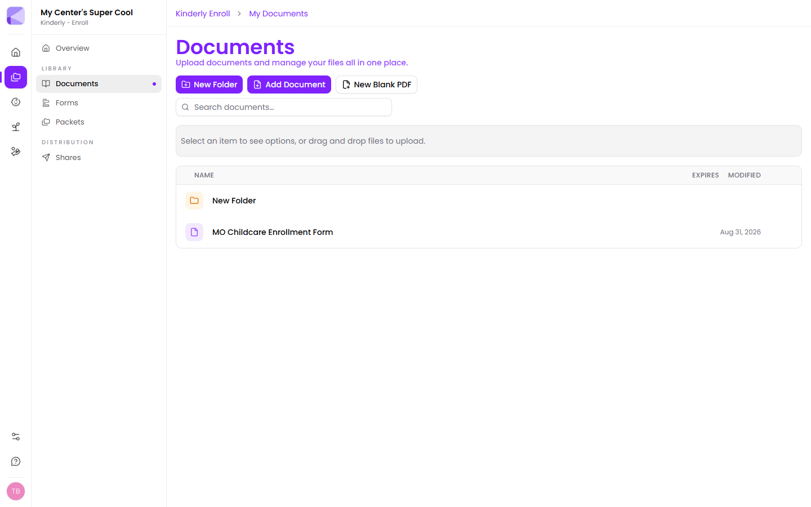

Documents is your centre's file library — the handbook, the state enrollment form, immunisation policies, custody templates. Anything you'd otherwise keep in a filing cabinet or a shared drive.

The difference is that a document in Kinderly isn't just stored. You can add fillable fields to it, send it to a family, and get a signed copy back.



## What you can do with a document

- **Organise** it into folders
- **Add fillable fields** — signatures, text boxes, checkboxes — on top of the PDF
- **Send** it to a family to complete and sign
- **Add it to a [packet](/packets/overview/)** as one step in a longer flow
- **Build a form from it** — Kinderly can read a fillable PDF's existing fields and turn them into a Kinderly [form](/forms/overview/)
- **Set an expiry** so out-of-date paperwork doesn't linger

## Getting files in

Three buttons at the top of the library:

- **Add Document** — upload a file from your computer.
- **New Folder** — create a folder to organise into.
- **New Blank PDF** — start an empty PDF you can build up with fields, without needing a source file at all.

You can also **drag and drop** files straight onto the library.

:::tip[Upload the fillable version if you have one]
State and county forms are often published in two flavours: a flat scan and a fillable PDF. Always upload the fillable one. Kinderly reads its existing fields automatically, which saves you placing them by hand — and it's the only version "[Start from document](/forms/overview/#four-ways-to-start)" can turn into a form.
:::

## A sensible folder structure

Documents you'll send repeatedly are worth separating from documents you just store. Something like:

```
Enrollment/        ← forms families fill in
Policies/          ← handbook, sick policy, things you send to read
Templates/         ← blanks you copy per child
Licensing/         ← your own records, never sent out
```

The point isn't the exact names — it's separating *send to families* from *keep for us*, so nothing confidential ends up one careless click from a share.

## Next

- [Managing files](/documents/managing-files/) — uploading, organising, expiry.
- [The document viewer](/documents/viewer/) — adding fields and signing.
