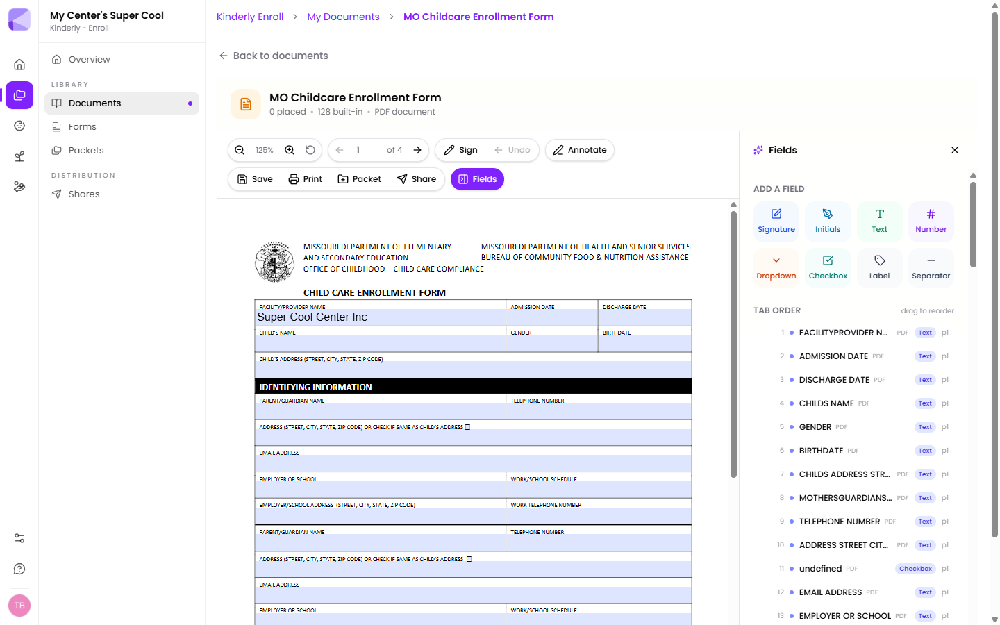

Opening a document gives you more than a preview — it's where you turn a flat PDF into something a family can fill in.

## Reading the header

Under the filename you get a running count, e.g. *"0 placed · 128 built-in · PDF document"*.

- **Built-in** — fillable fields that already existed in the PDF. Kinderly finds these on its own.
- **Placed** — fields *you've* added on top.

:::tip[Check the built-in count before placing anything]
A government form uploaded in its fillable version can arrive with a hundred-plus fields already detected. Placing your own on top of those is duplicated effort. Open the Fields panel and look at what's already there first.
:::

## The toolbar

**Top row** — zoom out, zoom level, zoom in, reset zoom; page back / page number / page forward; **Sign**; **Undo**; **Annotate**.

**Second row** — **Save**, **Print**, **Packet**, **Share**, **Fields**.

## Adding fields

Click **Fields** to open the panel, then pick a field type and place it on the page:

| Field | For |
|---|---|
| **Signature** | A full drawn signature |
| **Initials** | Initialling each page, as some agreements require |
| **Text** | Free text |
| **Number** | Numeric entry |
| **Dropdown** | Pick from a list you define |
| **Checkbox** | A tick |
| **Label** | Static text you add — not filled in by the family |
| **Separator** | A visual divider |

## Tab order

The **Tab Order** list shows every field in the order a family will move through them when pressing Tab. Each entry shows its name, type, and page.

Drag to reorder.

:::tip[Fix the tab order on any multi-column form]
PDF field order often follows how the file was built, not how it reads. On a two-column form that can mean tabbing from a name box straight to something halfway down the other side. Families filling this in on a phone feel it immediately. A minute spent dragging the order straight saves a lot of confused half-finished forms.
:::

## Signing

**Sign** lets you draw a signature with mouse or finger and place it.

**Undo** removes the last stroke rather than clearing everything — so a wobbly line doesn't mean starting over. `Ctrl+Z` does the same.

## Annotating

**Annotate** adds notes and marks on top of the document.

## Saving

**Save** writes changes back to the file in your library, replacing what was there.

:::caution[Save overwrites the original]
There's no separate "save a copy". If you want to keep a clean blank version, duplicate the file before adding fields — download it and re-upload under a different name.
:::

## Sending it out

- **Share** — send this document to a family on its own. See [Sending a share](/shares/sending/).
- **Packet** — add it to a packet as one step. See [Building a packet](/packets/building-a-packet/).

Fields you've placed travel with the document, so families get exactly what you set up.

## On phones

Families often open documents on a phone. The viewer opens at a zoom level chosen so the document is readable without sideways scrolling, panning works by dragging, and signing works with a finger.

:::tip[Preview your own document on a phone before you send it]
A signature box that's comfortable on a laptop can be a tiny target on a phone. If a document is going to lots of families, it's worth checking once.
:::

## Next

- [Managing files](/documents/managing-files/) — organising your library.
- [Sending a share](/shares/sending/) — getting it to families.
