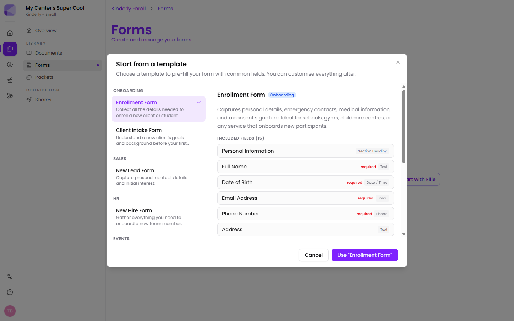
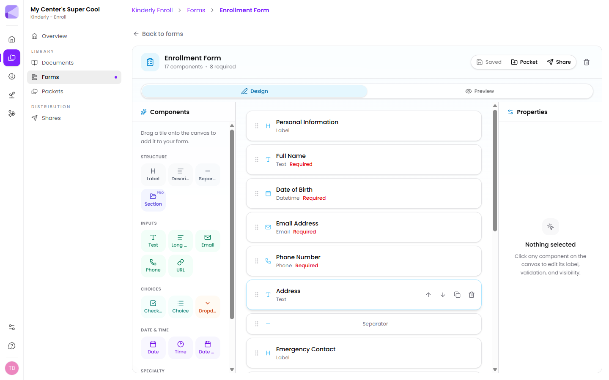
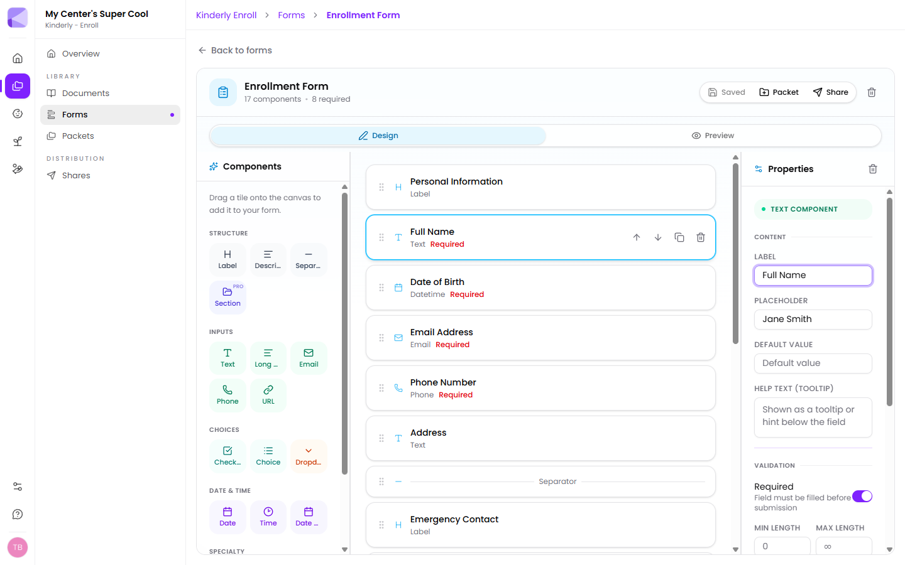
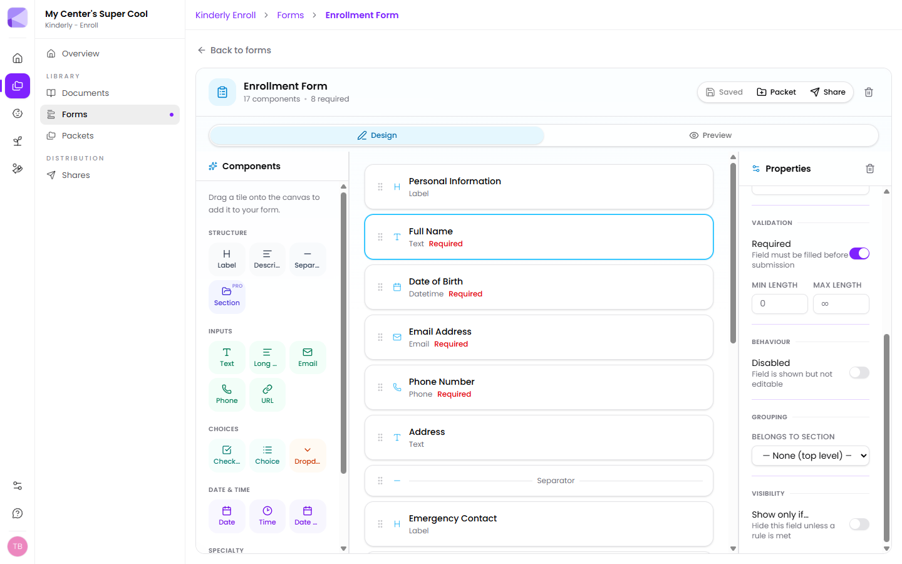
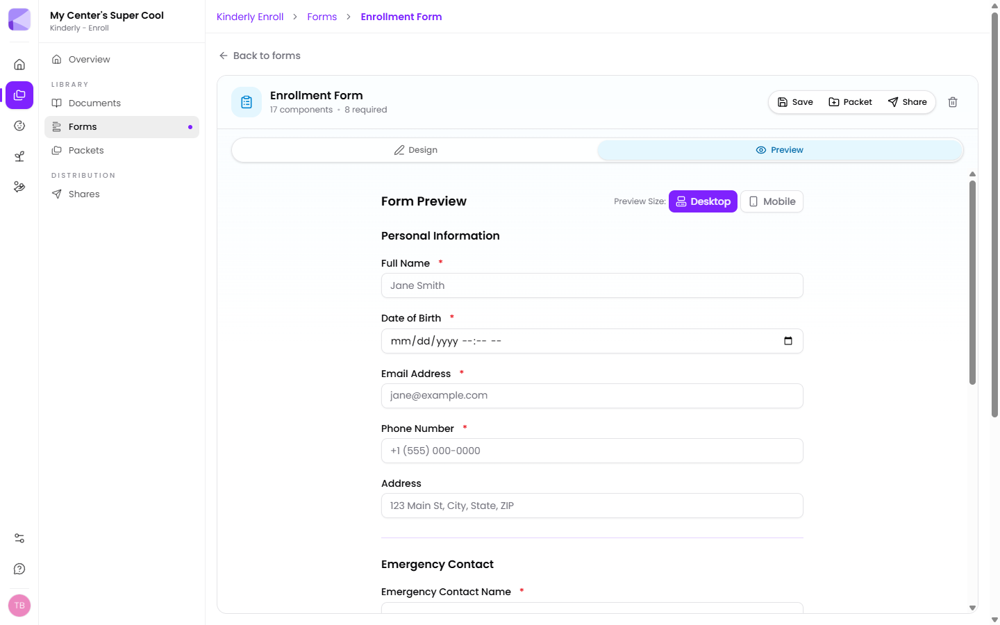

This walkthrough builds an enrollment form from a template. The same steps apply to any form.

## 1. Pick a starting point

Go to **Enroll → Forms** and choose **Start from template**. Templates are grouped by what they're for — Onboarding, Sales, HR, Events. Selecting one shows a full preview of every field it includes before you commit.

Click **Use "Enrollment Form"**. Kinderly creates the form and opens it in the builder.

## 2. Find your way around the builder

The builder has three panes.

- **Components** (left) — the palette. Drag a tile onto the canvas to add it.
- **The canvas** (middle) — your form, in order. This is the running order families will see.
- **Properties** (right) — settings for whichever component is selected. It says "Nothing selected" until you click something.

Above the canvas, **Design** and **Preview** switch between editing and seeing the form as a family will. The header shows a live count — "17 components · 8 required" — and a save indicator that reads **Saved** when there's nothing outstanding and **Save** when you have unsaved changes.

:::caution[Save before you leave]
The builder does not autosave every keystroke. If the header button says **Save** rather than **Saved**, click it before navigating away.
:::

## 3. Add, reorder, and remove components

- **Add** — drag a tile from the palette onto the canvas, dropping it where you want it.
- **Reorder** — drag a component by the grip handle on its left edge. Or hover it and use the **↑ / ↓** buttons.
- **Duplicate** — hover the component and click the copy icon. Much faster than rebuilding a field you've already configured.
- **Delete** — hover and click the bin icon.

:::tip[Duplicate your fiddliest field]
If you've set up a dropdown with fifteen options, duplicate it rather than building the next one from scratch — you keep every option and only change the label.
:::

## 4. Configure a component

Click any component on the canvas to open its settings.

The properties pane is grouped into sections. Exactly which appear depends on the component type, but most fields offer:

**Content**
- **Label** — the question, as the family reads it.
- **Placeholder** — faint example text inside the box. Use a real example ("Jane Smith"), not a repeat of the label.
- **Default value** — pre-fills the field. Handy for an answer that's nearly always the same.
- **Help text (tooltip)** — a hint shown below the field. This is where to put "as it appears on the birth certificate".

**Validation**
- **Required** — the family can't submit until it's filled.
- **Min / max length** — for text fields.

**Behaviour**
- **Disabled** — shown but not editable. Useful with a default value when you want information visible but locked.

**Grouping**
- **Belongs to section** — which section the field sits under, if you're using sections.

**Visibility**
- **Show only if…** — covered below.

:::tip[Use help text instead of longer labels]
A label of "Child's full legal name as it appears on their birth certificate" is a wall of text. Make the label "Child's full name" and move the rest into help text. The form reads faster and families still get the guidance.
:::

## Show a field only when it matters

Any field can be hidden until an earlier answer makes it relevant. Turn on **Show only if…** in the Visibility section and you get a three-part rule:

- **When field** — any other field in the same form.
- **Operator** — *equals*, *does not equal*, *contains*, *does not contain*, *is greater than*, or *is less than*.
- **Value** — what to compare against.

So to only ask about allergies when there are some: set **Known Allergies** to show only if **"Any allergies?" equals Yes**.

:::tip[This is the single best thing you can do to a long form]
Families abandon long forms. Hiding the follow-up questions behind their triggers can turn a visibly 40-field form into one that feels like 15. Nothing is lost — the hidden fields simply never applied.
:::

:::caution[Rules point backwards, not forwards]
Base a rule on a field that appears *earlier* in the form. If the field it depends on hasn't been answered yet, the rule can't evaluate sensibly.
:::

## 5. Preview before you send

Switch to the **Preview** tab to see the form exactly as a family will. This is the same renderer used for the real thing, so what you see is what they get.

Use the **Desktop / Mobile** toggle to check both.

:::tip[Always check Mobile]
Most families fill these in on a phone, often one-handed in a car park. Long dropdowns, wide tables, and multi-part questions that look fine on a laptop can be miserable on a phone. Check mobile before every send.
:::

## 6. Send it, or add it to a packet

From the builder header:

- **Share** — create a link for this form on its own. See [Sending a share](/shares/sending/).
- **Packet** — add this form to a packet as one step in a longer flow. See [Building a packet](/packets/building-a-packet/).

## Next

- [Field types](/forms/field-types/) — what every component does.
- [Packets](/packets/overview/) — combine forms and documents into one flow.
