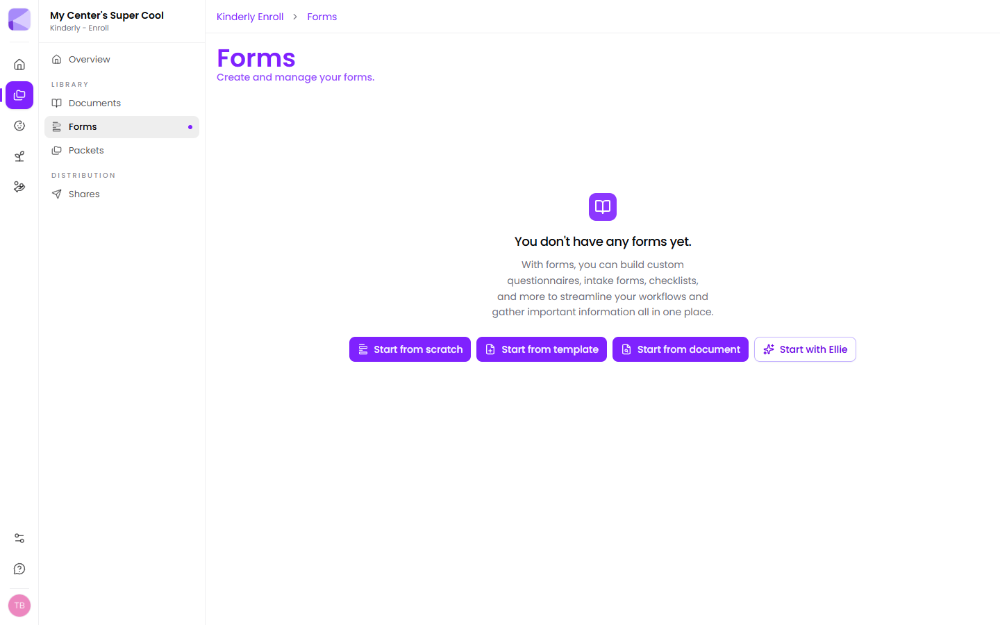

Forms are how Kinderly collects information from families — enrollment details, emergency contacts, photo consent, field-trip permission, medication authorisation. Anything you'd otherwise print, hand over at pickup, and chase for a week.

Once a form is built it's reusable. Send it on its own, or drop it into a [packet](/packets/overview/) as one step in a longer onboarding flow.

## Four ways to start

You don't have to build from a blank canvas. From **Enroll → Forms**, the four buttons do quite different things:

| Start from | What happens | Best for |
|---|---|---|
| **Scratch** | An empty canvas. You drag in every component. | Something genuinely unusual to your center |
| **Template** | A pre-built form, fully editable after. | Most cases — start here |
| **Document** | Reads the fillable fields out of a PDF already in your [Documents](/documents/overview/) library and turns the ones you pick into form fields. | Replacing a fillable PDF you already use |
| **Ellie** | Opens Ellie, the Kinderly assistant, and asks what you'd like to build. | When you know what you need but not how to lay it out |

:::tip[Start from a template, then delete]
Even when a template isn't a perfect fit, it's usually faster to pick the closest one and delete the fields you don't want than to build from scratch. The Enrollment Form template alone gives you 17 components — personal details, emergency contact, medical information, a confirmation checkbox and a signature — already grouped and marked required.
:::

:::note[About "Start from document"]
This one catches people out. It does **not** upload a file, and it doesn't read a scanned or flat PDF. It looks at PDFs already saved in your Documents library, finds the fillable form fields inside them, and lets you tick which of those to bring across. If the PDF has no fillable fields there's nothing to import — build the form from a template instead.
:::

If all four buttons are greyed out, you've hit the form limit on your plan. Hover any of them to see the limit, or see [Plans](/billing/plans/).

## What a form can collect

- **Text answers** — short text, long answers, email, phone, and web addresses
- **Choices** — checkboxes, radio-button choices, and dropdowns
- **Dates and times** — date, time, or both together
- **Signatures** — drawn with a finger or mouse, captured as an image
- **Uploads** — a photo (immunisation record, custody paperwork) or a document
- **Consent** — a block of legal text the family has to acknowledge
- **Payments** — collect a deposit or registration fee inline

Plus layout pieces that don't ask anything: headings, descriptive text, dividers, and inline images.

See [Field types](/forms/field-types/) for what each one does and when to reach for it.

## Two things worth knowing early

**Fields can hide themselves.** Any field can be set to appear only when an earlier answer matches a rule — so a "Which allergies?" field only shows up if the family ticked "Yes" to allergies. This keeps long forms feeling short. See [Building a form](/forms/building-a-form/#show-a-field-only-when-it-matters).

**Forms are not sent directly.** A form becomes something a family can fill in when you create a [share](/shares/overview/) — a private link with its own PIN. Building the form and sending it are separate steps, which means you can fix a typo without re-sending anything.

## Next

- [Building a form](/forms/building-a-form/) — the step-by-step walkthrough.
- [Field types](/forms/field-types/) — reference for every component.
- [Packets](/packets/overview/) — chain several forms and documents into one flow.
