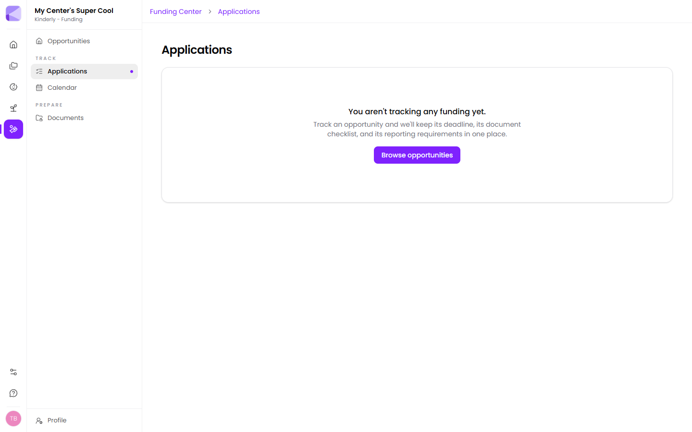

Tracking an [opportunity](/funding/opportunities/) creates an application. Each one keeps three things together:

- **Its deadline**
- **Its document checklist** — what this funder wants
- **Its reporting requirements** — what you'll owe after an award

That combination is the point. Applications go wrong because those three live in three places — a bookmarked webpage, an email thread, and someone's memory.

## Document checklists

Each application lists the documents it needs. Anything already in your [Documents](/funding/documents/) vault attaches automatically — you're only ever chasing the gap.

:::tip[Work the checklist backwards from the deadline]
The items you don't already hold are the ones with lead times — a fresh certificate of insurance, a signed board resolution, a letter of support. Those take days or weeks from other people. Start with what you *don't* have.
:::

## Reporting requirements

Recorded against the application from the start, so the obligation is visible before you commit rather than arriving as a surprise afterwards.

:::caution[Reporting obligations outlive the money]
A grant spent in three months can carry reporting for two years, and missing those reports can affect future eligibility with that funder. Read this before applying, not after the award lands.
:::

## Keeping it current

Update an application as it moves — submitted, awarded, declined. A declined one is still worth keeping: most funders run the same programme annually, and next year's application is far easier with this year's on file.

:::tip[Write down why you were declined]
Funders often say, and it's usually specific — the wrong provider type, a missing document, applying in the wrong window. That note is the single most useful thing you'll have next year.
:::

## Plan limits

Bloom tracks 5 grants; Flourish and Grove are unlimited. See [What you get](/getting-started/what-you-get/).

## Next

- [Calendar](/funding/calendar/) — everything by date.
- [Documents](/funding/documents/) — the shared paperwork vault.
