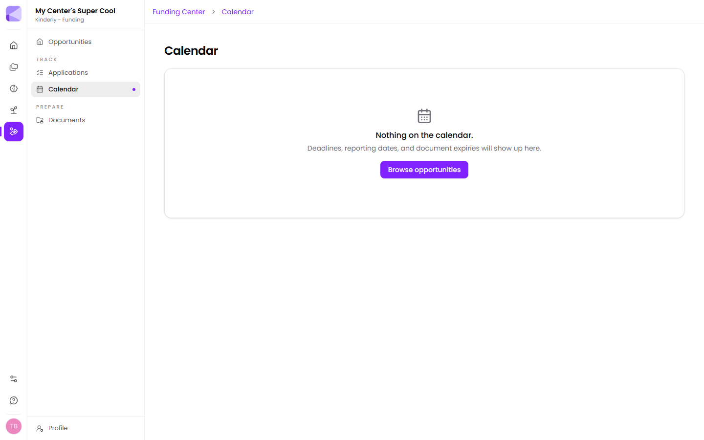

The calendar collects every date the Funding Center knows about:

- **Application deadlines** from the opportunities you [track](/funding/applications/)
- **Reporting dates** for funding you've been awarded
- **Document expiries** from your [vault](/funding/documents/)

## Why it's one view

Those three kinds of date fail in the same way — quietly, by passing. Kept in three places, the one you're not looking at is the one you miss. Together, "what's coming up" is a single question with a single answer.

:::tip[Check it weekly, not monthly]
A monthly check is enough to see a deadline but not always enough to act. Most missed applications aren't forgotten — they're spotted with four days left and a document that takes two weeks to obtain.
:::

## Nothing on it?

The calendar fills from what you've tracked. If it's empty, start by [tracking an opportunity](/funding/opportunities/) or uploading documents with expiry dates.

## Working backwards

For anything with a real deadline, work back from the date:

1. **The deadline** itself.
2. **A week before** — everything assembled and reviewed.
3. **Three weeks before** — request anything you need from other people. Letters of support, board sign-off and fresh certificates all depend on someone else's schedule.

:::caution[Deadlines are usually receipt, not postmark]
Most funders mean "in our hands by", and many close a portal at a specific hour. Treat the deadline as the day before, and never plan to submit on the final afternoon — portals get slow and occasionally fall over when everyone files at once.
:::

## Next

- [Applications](/funding/applications/) — what puts dates here.
- [Documents](/funding/documents/) — keeping expiries current.
