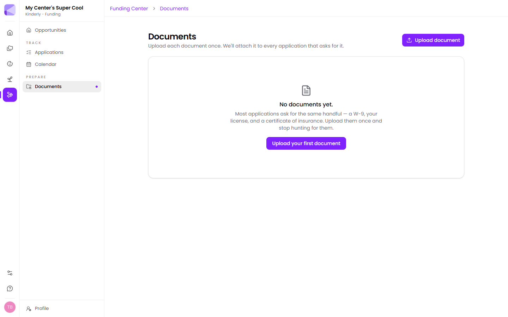

Most funding applications ask for the same handful of documents. The vault holds them once and attaches them to every [application](/funding/applications/) that asks.

**Upload document** adds one.

## What to put in

The usual suspects:

- **W-9**
- **Your licence**
- **Certificate of insurance**
- Financial statements or an annual budget
- Non-profit determination letter, if applicable
- Board list or organisational chart
- Your quality rating certificate

:::tip[Upload all of them in one sitting, before you need them]
The vault only saves you time if it's populated *before* a deadline. An hour spent gathering these now is the difference between an application taking twenty minutes and taking a week of chasing.
:::

## Document expiries

Documents expire — insurance certificates, licences, clearances. Expiry dates surface on your [calendar](/funding/calendar/).

:::caution[An expired document can sink an application after submission]
Funders check dates. A certificate of insurance that lapsed between submission and review is a common, avoidable rejection. The calendar exists so you renew before that happens, not after.
:::

## Separate from your Enroll documents

This vault is for *your center's* funding paperwork. The [Documents](/documents/overview/) library in Enroll is for things you send families. They're deliberately separate — nothing here is ever sent to a parent.

## Next

- [Calendar](/funding/calendar/) — expiry and deadline tracking.
- [Applications](/funding/applications/) — where documents get attached.
