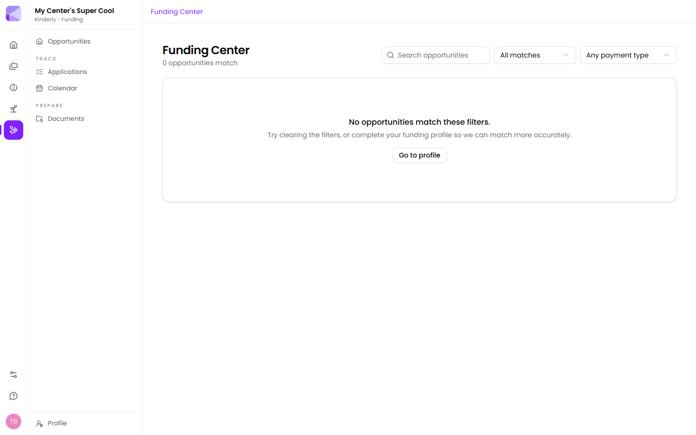

**Funding Center → Opportunities** lists grants you match, based on your [profile](/funding/profile/). The header tells you how many match.

## Searching and filtering

- **Search opportunities** — free-text search across the list.
- **All matches** — narrow how closely an opportunity has to fit.
- **Any payment type** — filter by how the money arrives (reimbursement, up-front award, and so on).

:::tip[Payment type is a cash-flow question, not a detail]
A reimbursement grant means *you* spend first and claim it back, sometimes months later. For a center without a cash buffer that's a very different proposition to an up-front award, however similar the headline figure looks.
:::

## Nothing matching?

If the list is empty, the profile is nearly always the reason. Kinderly says as much — offering to take you to your profile — because matching can only work from what it's been told.

Check especially: state and ZIP, licence status, provider type, capacity, and whether matching-fund grants are hidden.

## Choosing what to go for

Applications take real time, and the biggest number isn't always the best use of it. Worth weighing:

- **What does it actually pay for?** Equipment and quality-improvement grants tend to be simpler than program grants with reporting obligations attached.
- **How long is the reporting tail?** Some awards want reports for years. That's a commitment beyond the money.
- **Do you already have the documents?** An application needing paperwork you hold is a different job from one needing three things you'd have to go and get.
- **Is it recurring?** A grant you can apply for annually is worth more than its face value — the second application is far easier than the first.

:::tip[Your first application is the expensive one]
Assembling the standard documents takes a while the first time and almost no time afterwards. Don't judge the whole thing by how long application number one takes.
:::

## Tracking one

Tracking an opportunity turns it into an [application](/funding/applications/), which is where its deadline, document checklist and reporting requirements live.

:::tip[Track more than you'll apply for]
Tracking is not committing. It puts the deadline on your [calendar](/funding/calendar/) so the decision is yours to make in good time, rather than being made for you by a date passing.
:::

Plan limits cap how many you can track at once — 5 on Bloom, unlimited above. See [What you get](/getting-started/what-you-get/).

## Next

- [Applications](/funding/applications/) — tracking what you're going for.
- [Documents](/funding/documents/) — the paperwork applications ask for.
