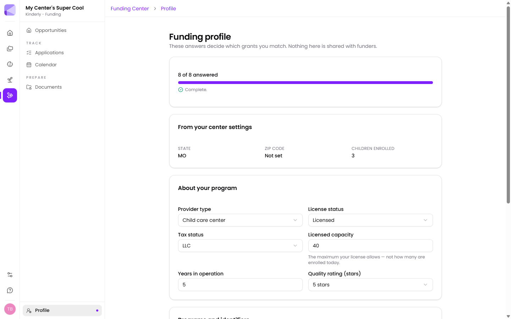

Your funding profile is a short questionnaire about your center. It's the only thing driving what appears in [Opportunities](/funding/opportunities/).

:::note[Nothing here is shared with funders]
The profile is used inside Kinderly to match you. It isn't submitted anywhere or sent to any funding body.
:::

A progress bar at the top shows how many questions you've answered — aim for complete.

## Pulled from your center settings

**State**, **ZIP code** and **children enrolled** come from [Manage → Settings](/manage/settings/) and your child records. If any show as *Not set*, fix them there.

:::caution[A missing ZIP code costs you matches]
Plenty of grants are geographically restricted, sometimes to specific counties or ZIPs. If yours is blank you'll silently miss those — they just never appear.
:::

## About your program

| Field | Notes |
|---|---|
| **Provider type** | Child care center, family child care home, and so on |
| **License status** | Licensed, licence-exempt, etc. |
| **Tax status** | LLC, non-profit, sole proprietor… |
| **Licensed capacity** | The maximum your **licence allows** — not how many are enrolled today |
| **Years in operation** | Some grants target new providers, others established ones |
| **Quality rating (stars)** | Your QRIS rating |

:::caution[Licensed capacity is your licence limit, not your roll]
It's the field most often filled in wrongly. A center licensed for 60 with 40 enrolled should enter 60. Entering 40 can push you under the threshold for capacity-based grants you actually qualify for.
:::

:::tip[Tax status matters more than it looks]
A good number of foundation grants are restricted to non-profits, and some public funds work the other way. Getting this right removes a lot of noise in both directions.
:::

## Programs and identifiers

- **Participate in CACFP (food program)?**
- **Accept child care subsidy / vouchers?**
- **License number**
- **EIN**
- **License expires**

:::tip[Answer yes to CACFP and subsidy if you do either]
Both are common eligibility gates, particularly for grants aimed at providers serving lower-income families. They're also two of the highest-value filters in the whole profile.
:::

:::tip[The licence expiry date earns its keep]
Kinderly can put it on your [calendar](/funding/calendar/) as a document expiry. An expired licence doesn't just risk an application — it can disqualify one mid-review.
:::

## Matching funds

A **Show grants that require matching funds** toggle controls whether opportunities needing you to put up money of your own appear.

:::tip[Leave matching-fund grants visible until you've looked]
"Matching" often means in-kind — staff time, existing equipment, donated space — rather than cash you have to find. Hiding them by default can remove some of the larger awards from view.
:::

## Keeping it current

Revisit after anything that changes your eligibility: a new quality rating, a capacity change, a licence renewal, or becoming a non-profit.

## Next

- [Opportunities](/funding/opportunities/) — see what you match.
- [Documents](/funding/documents/) — get the paperwork ready.
