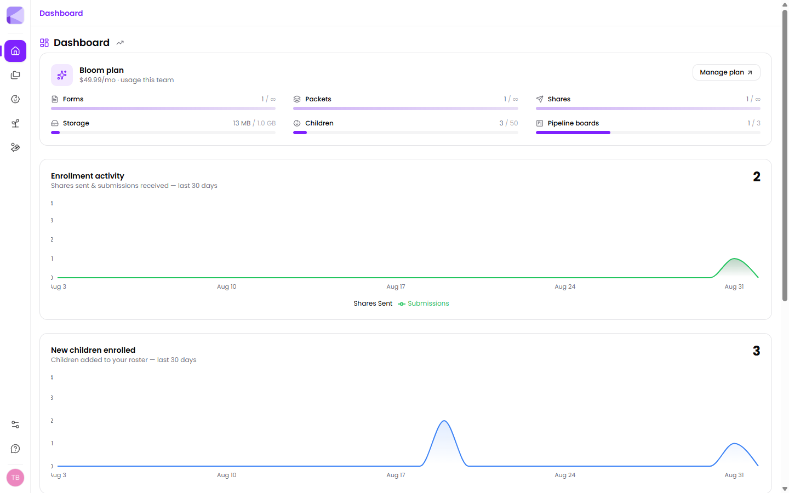
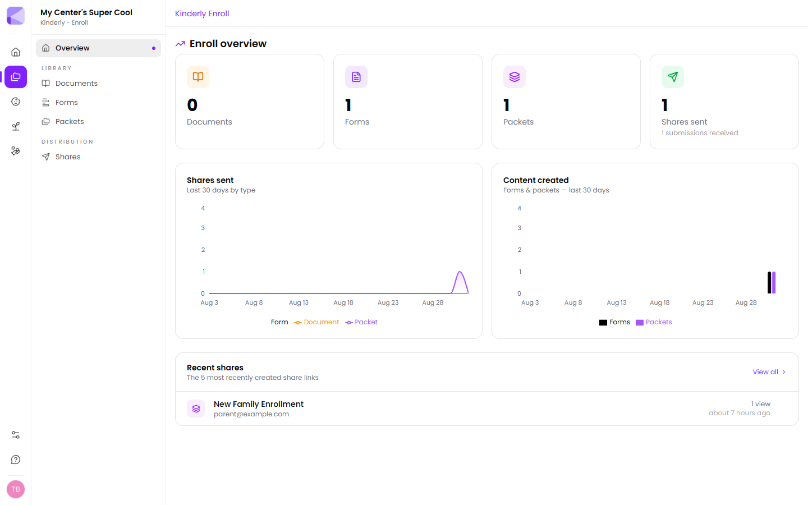

Kinderly is childcare management built around the paperwork and admin that eats your week — enrolling families, chasing signatures, keeping records straight, filling places, and finding funding.

It's four products under one login. You don't have to use all of them.

## The four parts

| | What it's for |
|---|---|
| **[Enroll](/forms/overview/)** | Build forms and documents, bundle them into packets, and send them to families as secure links. This is where the paperwork lives. |
| **[Manage](/manage/overview/)** | The day-to-day running of your center — children, guardians, classrooms, staff, programs, scheduling, attendance, messages and family billing. |
| **[Grow](/grow/overview/)** | Filling your places: a website for your center, virtual tours, and an enquiry pipeline to track prospective families. |
| **[Funding](/funding/overview/)** | Finding and tracking grants and funding opportunities, with deadlines and application records in one place. Paid plans only. |

Switch between them from the icon rail down the left-hand side.

Enroll, Manage and Grow are on every plan including the free one. See [What you get](/getting-started/what-you-get/).

## The dashboard

Signing in lands you on the dashboard: your plan and how much of it you're using, enrollment activity, and new children over the last 30 days.

The usage bars are the quickest way to see where you stand — children against your plan's cap, document storage, forms, packets, shares and pipeline boards.

Each product also has its own overview. Enroll's shows what you've built, what you've sent, and your most recent shares:

## Where to start

If you're new, the fastest way to feel the value is to send one thing to one family:

1. **[Build a form](/forms/building-a-form/)** from a template — a few minutes.
2. **[Send it](/shares/sending/)** to yourself first, so you see exactly what a family sees.
3. **[Review what comes back](/shares/admin/)**.

Once that clicks, everything else is a variation on it.

:::tip[Send the first one to yourself]
Before a real family gets anything, send a share to your own email. You'll see the email, the PIN screen, the form on your phone, and the submission landing on your side — the whole loop in about five minutes. It's the single best way to understand the product, and it catches anything confusing before a parent hits it.
:::

## Ellie

Ellie is Kinderly's built-in assistant. It shows up throughout the app — drafting a form from a description, searching your shares in plain English, and answering questions about your data. Ellie is included on every plan.

## Next

- [What you get](/getting-started/what-you-get/) — plans and limits.
- [Account setup](/getting-started/account-setup/) — getting configured.
