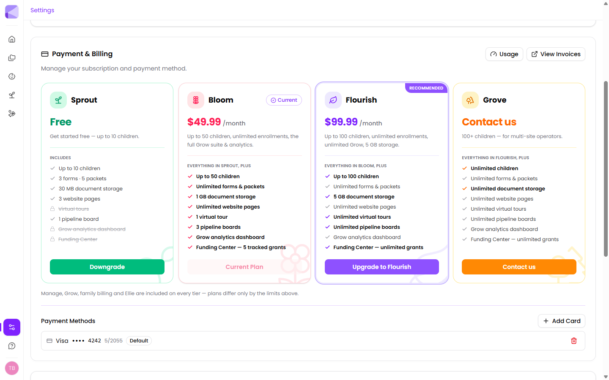

**Enroll, Manage, Grow, family billing and Ellie are on every tier**, including the free one. Mostly what you're buying when you upgrade is bigger ceilings, not new features — with three exceptions, all on the free tier: virtual tours, the Grow analytics dashboard, and the Funding Center.

## The plans

| | **Sprout** | **Bloom** | **Flourish** | **Grove** |
|---|---|---|---|---|
| | Free | $49.99/mo | $99.99/mo | Contact us |
| **Children** | Up to 10 | Up to 50 | Up to 100 | Unlimited |
| **Forms & packets** | 3 forms · 5 packets | Unlimited | Unlimited | Unlimited |
| **Document storage** | 30 MB | 1 GB | 5 GB | Unlimited |
| **Website pages** | 3 | Unlimited | Unlimited | Unlimited |
| **Pipeline boards** | 1 | 3 | Unlimited | Unlimited |
| **Virtual tours** | — | 1 | Unlimited | Unlimited |
| **Grow analytics** | — | Yes | Yes | Yes |
| **Funding Center** | — | 5 tracked grants | Unlimited | Unlimited |

**Grove** is for multi-site operators with 100+ children.

## Which one fits

**Sprout** is a genuine free tier, not a trial. A childminder or a very small setting can run on it indefinitely. The binding constraint is usually the 30 MB storage — a handful of scanned PDFs will fill it.

**Bloom** is the common choice for a single centre. Unlimited forms and packets is the jump that matters: you stop rationing which paperwork goes through Kinderly. It's also where virtual tours, Grow analytics and the Funding Center switch on.

:::tip[If you're chasing grants, Sprout won't do it]
The Funding Center is the one thing on the free tier you can't work around. If tracking grant deadlines is part of why you're here, that alone is the reason to be on Bloom — a single grant caught in time tends to cover the year's subscription.
:::

**Flourish** is for larger centres, or anyone who wants unlimited virtual tours and pipeline boards for a serious enrollment funnel.

:::tip[Storage is usually what pushes you up, not children]
Centres tend to watch the children count and get caught out by storage. Every signed document a family returns is a stored PDF. A 40-child centre running full enrollment packets goes through 30 MB quickly. Check the storage bar on your dashboard before assuming you're comfortable.
:::

## How limits behave

Limits are enforced as you go, not billed as overage:

- Approaching a limit, the relevant buttons **grey out** rather than letting you overspend.
- Hover a disabled button and it tells you which limit you've hit.
- Nothing already created stops working.

So hitting a limit is a nuisance, never a surprise bill.

:::caution[Check your limits before a busy intake]
Discovering the packet limit halfway through September enrollment is an awkward time to find out. Before an intake period, look at the usage bars on your dashboard and make sure you have headroom.
:::

## Seeing where you stand

The dashboard shows a bar for each limit — forms, packets, shares, storage, children and pipeline boards — with current usage against the cap. `∞` means unlimited on your plan.

## Changing plan

**Settings → Payment & Billing** lists every tier with your current one marked. Upgrade or downgrade from there.

See [Plans](/billing/plans/) for more detail.

## Next

- [Account setup](/getting-started/account-setup/) — getting configured.
- [Billing & subscriptions](/billing/overview/) — payment methods and invoices.
