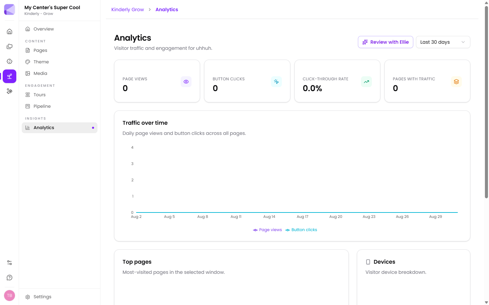

**Grow → Analytics** shows traffic and engagement for your site over the last 30 days.

## The headline numbers

- **Page views**
- **Button clicks**
- **Click-through rate**
- **Pages with traffic**

## The breakdowns

- **Traffic over time** — daily page views and button clicks
- **Top pages** — most visited in the window
- **Devices** — what visitors are browsing on
- **Top button clicks** — where people are actually clicking
- **Top referrers** — external sources sending traffic

**Review with Ellie** asks the assistant to interpret the numbers rather than leaving you to read charts.

## What to actually look at

**Click-through rate** is the one that matters. Page views tell you people arrived; CTR tells you the page persuaded them to do something. A page with high views and low CTR is being found and then failing.

**Top button clicks** tells you which call-to-action works. If "Book a tour" is clicked ten times more than "Enquire now", make the enquiry button say "Book a tour" too.

**Devices** is usually decisive. Most families browse childcare on a phone. If your traffic is overwhelmingly mobile, that's the layout that matters — check your pages there.

**Top referrers** shows where families come from. "Mostly direct" means word of mouth and people typing your name in — which is a compliment, but also means your site isn't being *found* by people who don't already know you.

:::tip[Compare the tour page's views against enquiry clicks]
That ratio is the single most useful number in Grow. Lots of tour views and few enquiries means the tour isn't ending in a clear next step — usually a weak or missing call-to-action.
:::

:::caution[Small numbers aren't trends]
A centre's site might get a few dozen visits a week. At that volume one afternoon of a parent browsing repeatedly can look like a spike. Look at the shape over a month, not day to day.
:::

## Plan availability

The analytics dashboard isn't included on the free tier. See [What you get](/getting-started/what-you-get/).

## Next

- [Page sections](/grow/page-sections/) — improving what analytics shows you.
- [Pipeline](/grow/pipeline/) — where enquiries go.
