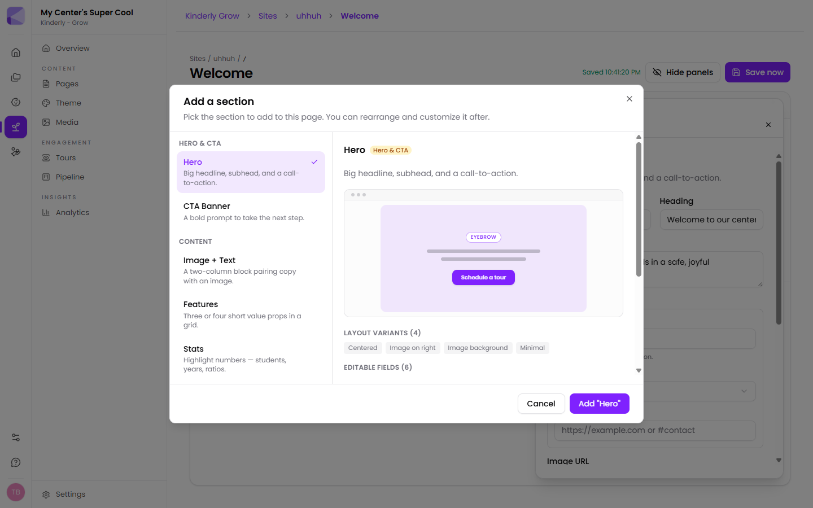

Pages are built by stacking sections. Add one with the **+** in the Sections panel, then fill in its fields.

Every section shows its **layout variants** and **editable fields** before you add it, so you can see what you're getting.

## Hero & CTA

| Section | What it's for |
|---|---|
| **Hero** | The big opening: eyebrow, headline, subhead, call-to-action button and image. Four layouts — Centered, Image on right, Image background, Minimal |
| **CTA Banner** | A bold prompt to take the next step |

## Content

| Section | What it's for |
|---|---|
| **Image + Text** | Two columns pairing copy with an image |
| **Features** | Three or four short value props in a grid |
| **Stats** | Highlight numbers — children, years open, ratios |
| **About** | Who you are and what makes you different |
| **Image + Text carousel** | Multiple image-and-text slides |
| **Virtual tour** | Embed a [tour](/grow/tours/) as an entry card, a full-bleed cover, or an immersive full-page viewer |
| **Compliance** | Regulatory disclosures — licence number, capacity, ratios, food program, accreditations |

:::tip[The Compliance section does real work]
Licence number, capacity and ratios are exactly what a diligent parent goes looking for and often can't find. Putting them in a proper section signals you have nothing to hide — and in some states it's a disclosure requirement anyway.
:::

## Media

| Section | What it's for |
|---|---|
| **Gallery** | A photo grid of your space |
| **Video** | An autoplaying muted video — good as a hero loop or facility tour |
| **Video carousel** | Several videos to swipe through |

## Social proof

| Section | What it's for |
|---|---|
| **Testimonial** | A short quote from a happy family |
| **Testimonial carousel** | Several quotes |
| **FAQ** | The questions families always ask |

:::tip[Write the FAQ from your actual inbox]
The questions worth answering are the ones you already answer by email every week — hours, fees, the waiting list, what to bring on the first day. Every one you answer on the page is one you stop answering by hand.
:::

## Forms

| Section | What it's for |
|---|---|
| **Kinderly form / document** | Embed a Kinderly [form](/forms/overview/), document or [packet](/packets/overview/) inline on the page |

This is what turns a brochure site into something that generates enquiries. See [Grow overview](/grow/overview/#how-it-fits-together).

## Manage

| Section | What it's for |
|---|---|
| **Center Feed** | Pulls in posts from your [Manage center feed](/manage/feed/) — pinned first, then newest |

:::tip[The feed section keeps your site alive without extra work]
A site that hasn't changed in a year looks abandoned. Because this section pulls from the feed you're already posting to for current families, your public site stays current as a side effect.
:::

## Contact

| Section | What it's for |
|---|---|
| **Contact** | Address, phone and email |

## Section layout

Most sections offer:

- **Style** — the layout variant (e.g. Centered, Image on right, Image background, Minimal)
- **Background color**
- **Spacing**

Images can be uploaded directly or picked from the [media library](/grow/sites/#media) — PNG, JPG, WEBP, GIF or SVG up to 10 MB. Every image takes **alt text**.

:::tip[Fill in alt text]
It's what screen readers announce, and what search engines read. It takes five seconds — "toddlers painting at the art table" — and it's the difference between an accessible site and one that isn't.
:::

## A workable homepage

1. **Hero** — who you are, one line, and a "Book a tour" button
2. **Features** — three things that make you different
3. **Virtual tour** — let them look around
4. **Testimonial** — a parent saying it instead of you
5. **Kinderly form** — the enquiry form, on the page
6. **Compliance** — licence, capacity, ratios
7. **Contact**

## Next

- [Theme](/grow/theme/) — making it look like your center.
- [Virtual tours](/grow/tours/) — building a tour to embed.
