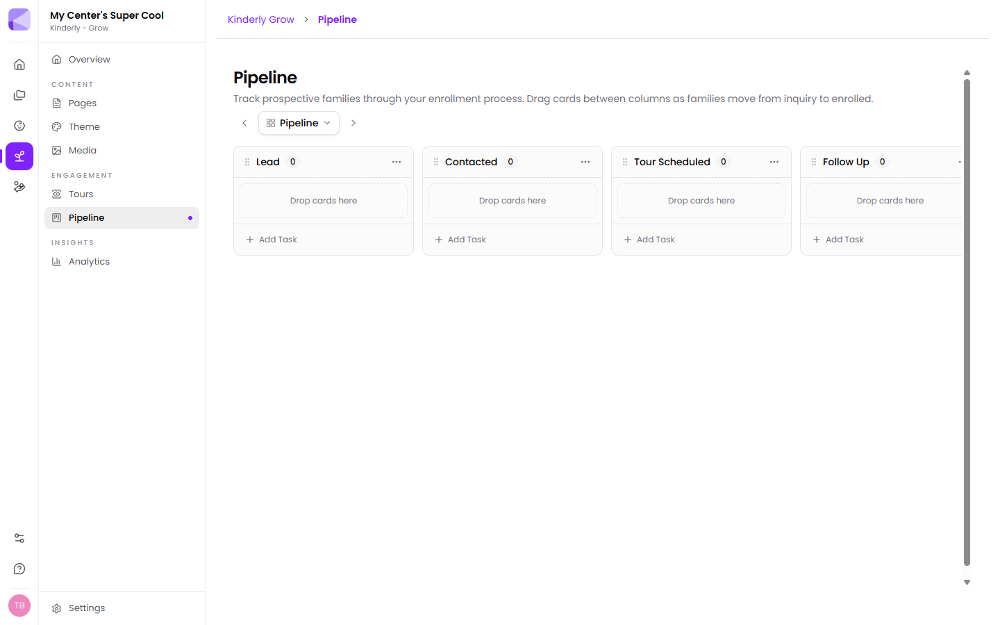

The pipeline is a board of columns. Each prospective family is a card, and you drag it right as they move toward enrolling.

## The default columns

**Lead → Contacted → Tour Scheduled → Follow Up → Enrolled**

That's a sensible enrollment funnel out of the box. **Add Column** adds your own — a **Waitlist** column is the usual first addition.

:::tip[Add a Waitlist column early]
Without one, families you can't place yet either sit in Follow Up looking like they need chasing, or drop off the board entirely. A waitlist column keeps them visible for when a place opens — and those are your warmest possible leads.
:::

## Cards

A card is one prospective family. Drag between columns as things progress.

Cards carry **tasks** — **Add Task** on a column adds one — so "ring back Thursday" lives on the card rather than in your head.

:::tip[Every card in a middle column should have a next action]
Cards go stale in Contacted and Follow Up, where the next step is always "someone should chase this". If a card has no task, nobody is chasing it. That's the discipline the board is for.
:::

## Attaching shares

A card can have [shares](/shares/overview/) attached, which is how a prospect becomes an enrolled family without retyping anything.

When a family is ready, send the enrollment [packet](/packets/overview/) and attach it to their card. You can see what's been sent and what's come back without leaving the board.

:::tip[Attach the packet before moving the card to Enrolled]
"Enrolled" should mean the paperwork is done, not that they said yes on the phone. Attaching the packet to the card means the board shows real status rather than optimism.
:::

## Filling the board automatically

An enquiry [form](/forms/overview/) embedded on your [site](/grow/page-sections/#forms) can create a pipeline card when it's submitted, via the **Add card to Kinderly Grow** [action](/actions/overview/) on a [packet](/packets/building-a-packet/).

That closes the loop: a family finds your site at 10pm, fills in the form, and a card is waiting for you in Lead the next morning.

## Multiple boards

Plans allow different numbers of boards — one on Sprout, three on Bloom, unlimited above. See [What you get](/getting-started/what-you-get/).

Separate boards make sense for genuinely separate processes — a second site, or a summer camp with its own intake. For one centre's ordinary enrollment, one board with good columns beats several.

## Next

- [Analytics](/grow/analytics/) — what's driving enquiries.
- [Packets](/packets/overview/) — the paperwork once they enrol.
