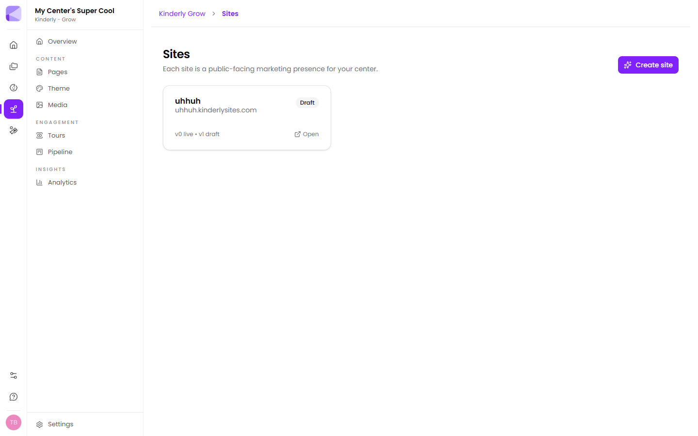
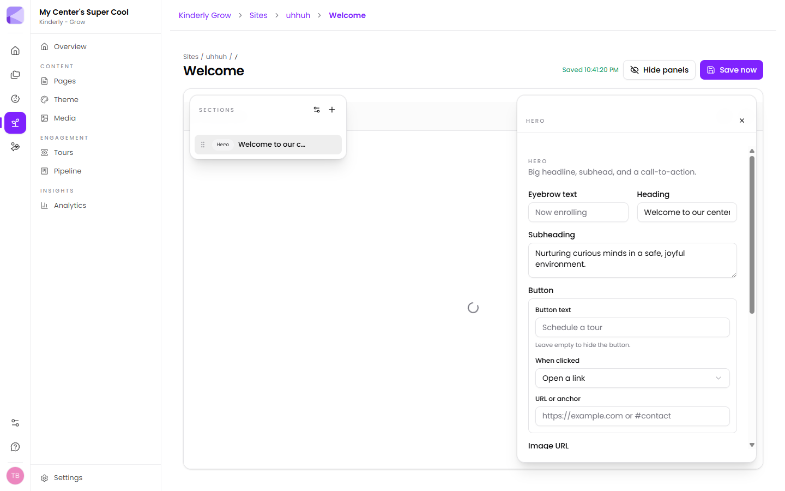

A **site** is a public marketing presence for your center. A **page** is a URL on that site.

## Creating a site

**Grow → Sites → Create site**. Each site gets a free address at `yourname.kinderlysites.com`.

:::note[Custom domains are coming, not here]
The Domains area is still under development. For now every site lives on its `kinderlysites.com` address. If you already have a domain, you can point visitors at the Kinderly address from your existing site in the meantime.
:::

## Drafts and publishing

This is the most important thing to understand about Grow, and it's what stops you embarrassing yourself in public.

**Every edit saves to a draft.** The site list shows both states — something like *"v0 live • v1 draft"*, meaning version 0 is what families see and version 1 is what you've been working on.

A site marked **Not published** isn't visible to families at all until you press **Publish**.

:::tip[You can rebuild your whole site in the middle of the day]
Because edits only touch the draft, nothing you do is visible until you publish. Rewrite every page, change all the photos, get it wrong, fix it — the live site sits unchanged until you're happy.
:::

:::caution[Saved is not published]
The editor autosaves, and it'll tell you so. That's the *draft* being saved. Families still see the last published version. If you've made a change and parents say they can't see it, you almost certainly haven't published.
:::

## Pages

**Grow → Pages** lists every page with its title, path and when it was last edited. **New page** creates one.

The page at path `/` is your homepage.

:::tip[Start with fewer pages than you think]
A homepage, a programs page, and a contact page will out-perform a twelve-page site that's half-finished. You can always add more — and [analytics](/grow/analytics/) will tell you what families actually want.
:::

## The page editor

Opening a page gives you a two-panel editor over a live preview.

- **Sections** (left) — the blocks making up the page, in order. Drag by the handle to reorder. The **+** adds a new one.
- **Section settings** (right) — the fields for whichever section is selected.
- **Draft preview** shows how it looks.
- **Hide panels** clears the editing chrome so you can see the page properly.
- **Save now** forces a save; it autosaves as you go and shows the time it last saved.

Pages are built by stacking sections. See [Page sections](/grow/page-sections/) for the full catalogue.

## Media

**Grow → Media** holds the images your pages use. Drag files in or use **Upload media**. Images can be picked from the library when editing any section.

:::tip[Upload your photos before you start building]
Getting your best classroom and outdoor photos into the library first means building a page is picking images rather than stopping to hunt through your phone.
:::

## Next

- [Page sections](/grow/page-sections/) — what you can put on a page.
- [Theme](/grow/theme/) — colours and fonts across the site.
