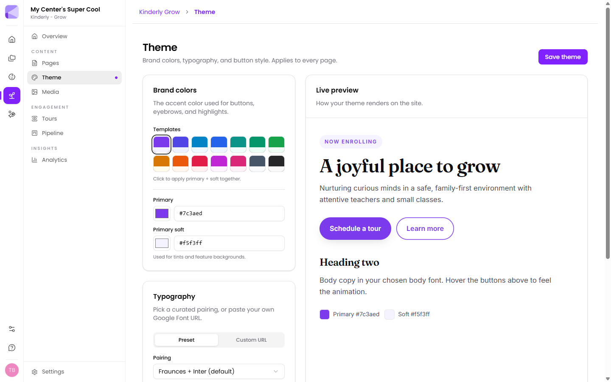

**Grow → Theme** sets the look of every page at once. Change it here rather than fiddling with individual sections.

## Brand colours

- **Primary** — the accent used for buttons, eyebrows and highlights.
- **Primary soft** — used for tints and feature backgrounds.

**Templates** applies a matched primary and primary-soft pair together, which is the easy route if you don't have brand colours already.

:::tip[Use a template unless you have a brand guide]
Picking two colours that work together is harder than it looks — a primary and a soft tint that clash make a site feel amateurish in a way that's hard to put your finger on. The templates are pre-matched.
:::

## Typography

Either a **Preset** pairing — the default is Fraunces + Inter — or a **Custom URL** where you paste your own Google Font link. With a preset, heading and body fonts are set for you.

:::caution[Custom fonts are the easiest way to make a site look worse]
The presets are chosen so heading and body fonts work together at the right sizes. A single custom font used for everything usually reads worse than the default pairing. Only go custom if you're matching an existing brand.
:::

## Buttons

- **Shape** — Pill, Rounded or Square.
- **Hover animation** — e.g. Lift, a subtle shadow and rise.

This applies to every call-to-action on the site, so your "Book a tour" and "Enquire now" buttons stay consistent.

## Live preview

A preview panel shows how the theme renders. Check it before saving — colour choices look different applied across a page than they do as swatches.

## Saving

**Save theme** applies your changes. Like everything else in Grow, this goes to the **draft** — families see it when you [publish](/grow/sites/#drafts-and-publishing).

## Next

- [Page sections](/grow/page-sections/) — the blocks the theme styles.
- [Sites and pages](/grow/sites/) — publishing your changes.
