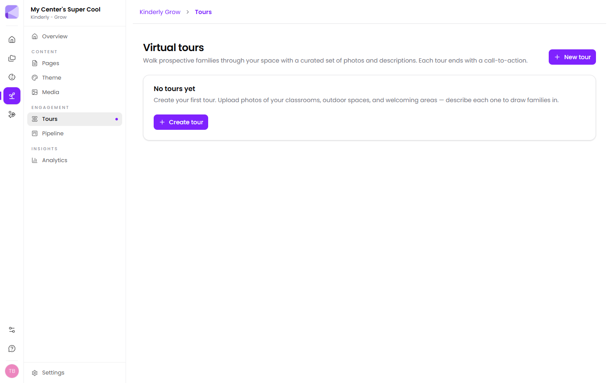

A virtual tour is a curated set of photos with descriptions, ending in a call-to-action. It lets a family look around at 10pm on a Sunday, which is when people actually research childcare.

**Grow → Tours → New tour** creates one. Upload photos of your classrooms, outdoor spaces and entrance, and describe each one.

## Why bother

Booking a tour is a commitment, and commitment is where enquiries die. A virtual tour lets families self-qualify first — so the in-person tours you do give are to people already fairly sure.

:::tip[Photograph the space, not the empty room]
An empty classroom at 7am is tidy and says nothing. Children absorbed in something, a well-used book corner, the outdoor space in use — that's what parents are trying to picture. Get permission for any photo with children in it.
:::

## Descriptions

Each photo takes a description. This is where you say the thing the photo can't: how the room is staffed, what a morning looks like, why the space is laid out that way.

:::tip[Answer the worry, not the feature]
"Our infant room has a 1:4 ratio and the same two teachers every day" addresses what a parent leaving a baby is actually anxious about. "Spacious, well-equipped infant room" doesn't.
:::

## The call-to-action

Every tour ends with one. Make it the obvious next step — book a visit, or an enquiry [form](/forms/overview/) that drops straight into your [pipeline](/grow/pipeline/).

## Putting a tour on your site

The **Virtual tour** [page section](/grow/page-sections/) embeds one three ways:

- **Entry card** — a small teaser
- **Full-bleed cover** — a prominent band
- **Immersive viewer** — takes over the whole page

:::tip[Card on the homepage, immersive on its own page]
A tour that hijacks your homepage gets in the way of families who came for your fees. Tease it with a card and give the immersive version its own page for people who want to look properly.
:::

## Plan limits

Virtual tours aren't available on the free tier. Bloom includes one; Flourish and Grove are unlimited. See [What you get](/getting-started/what-you-get/).

:::tip[With one tour, make it the whole centre]
On Bloom you get one — so build a single tour walking through the entire setting rather than one room. Save per-room tours for when you have unlimited.
:::

## Next

- [Page sections](/grow/page-sections/) — embedding a tour.
- [Pipeline](/grow/pipeline/) — where the enquiries land.
