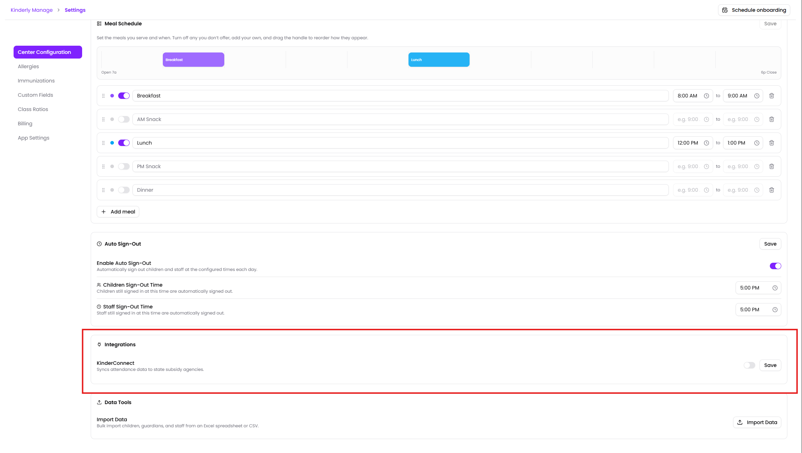
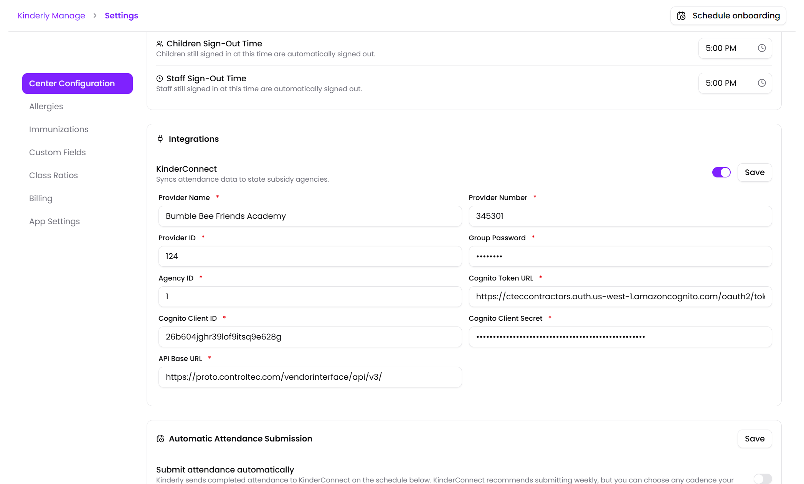
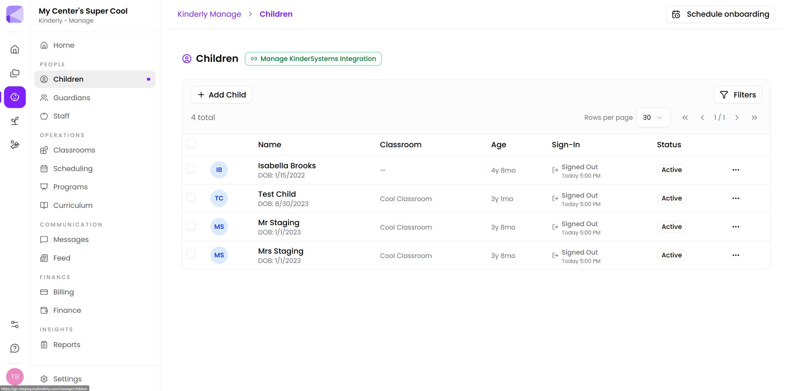
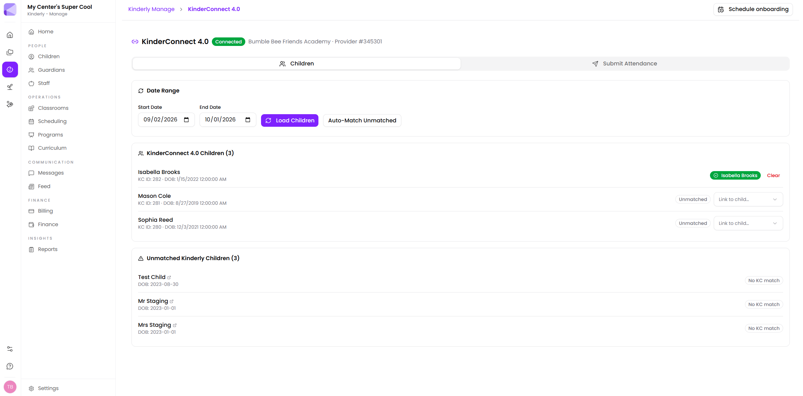
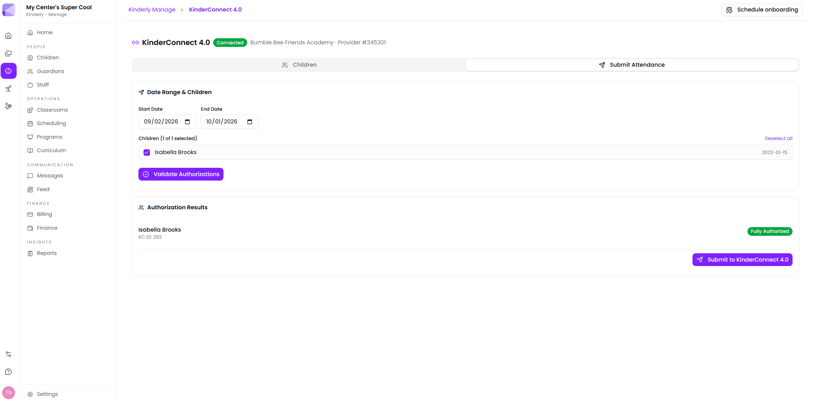
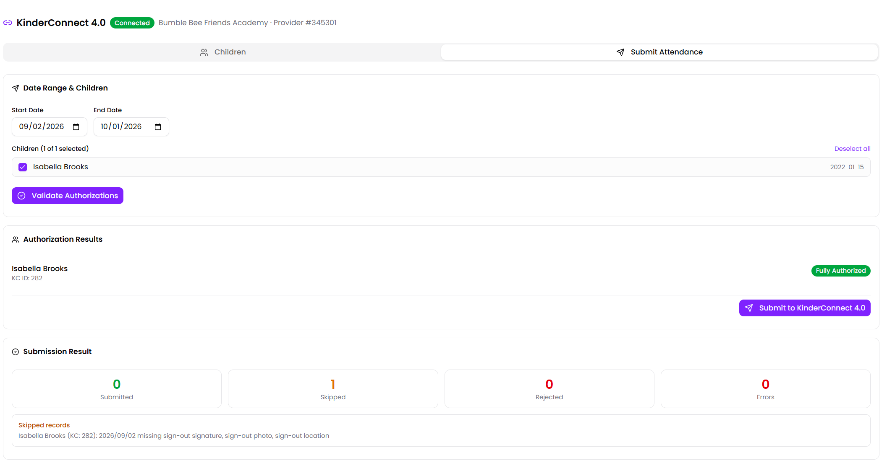

Kinderly connects to **KinderSystems / KinderConnect** so you can send attendance to your state agency without keying it in twice.

There are three parts: connecting your account, **matching** your children to KinderSystems' records, and **submitting** attendance — either by hand or on a schedule.

## Setting it up

Enter your credentials under **Manage → Settings → Integrations → KinderConnect**:

- **Provider ID**, **Group Password**, **Agency ID** — your KinderSystems provider credentials
- **Cognito** credentials (base API, client ID, client secret)
- **Base API URL**

To get your **Provider Number**, **Group Password** and **Agency ID**, please contact your KinderSystems rep. Kinderly cannot provide you with this information

:::caution[Treat these as passwords]
These credentials submit attendance that drives subsidy payments.
:::

Once you enter your credentials, click "Save".

You can view the auto-match status by going to **Manage** → **Children** → **Manage KinderSystems Integration**

Saving with the integration **enabled** immediately runs an auto-match, which doubles as a connection test.

Once the connection is enabled, you can access the **KinderConnect Integration** page from **Manage → KinderConnect**. Click the "Manage KinderSystems Integration" to enter the integration page.

In the integration page, you can auto-match children, submit attendance, and link childing in Kinderly to children in KinderConnect.

To submit attendance manually, click the **Submit Attendance** tab, and select the children you'd like to submit.

:::caution[Make sure you select the correct date range]
Selecting a date range outside of a child's valid authorization will result in a failed batch.
:::

After you submit, you'll see a summary of the submission, including any errors. If you see any **Skipped Records** or errors, work through the issues before submitting again.

## Matching children

Kinderly has to know which of your children corresponds to which KinderSystems record. It pulls the KinderSystems children list for the current month and compares.

| Result | What it means |
|---|---|
| **Matched** | First name, last name **and** date of birth all matched. The KinderSystems ID is stored on the child. |
| **Needs Review** | **Last name and date of birth** matched but the first name didn't. Kinderly won't guess — you confirm or reject it. |
| **Not Found** | No candidate in KinderSystems. |

Name comparison ignores case and surrounding spaces.

:::tip[Needs Review is almost always a nickname]
The partial match is last name plus date of birth, so it's usually the same child recorded as "Katie" in one system and "Katherine" in the other. Worth working through — each one is a child whose attendance won't submit until it's resolved.
:::

:::caution[A child with no date of birth can never match]
Matching requires a date of birth on both sides. A child record missing one is skipped entirely — it won't even show as Not Found. If a child never appears in any bucket, check their [record](/manage/children/) has a DOB.
:::

### Matching by hand

For anything that didn't match, open the child's row actions in **Children** and use **Match to KinderSystems** to pick the right record yourself.

### The daily re-check

A job runs **daily at 07:00 UTC** and re-runs auto-match for every center with KinderConnect enabled, picking up children you've added since.

:::note[07:00 UTC, not 7am your time]
That's roughly 2am US Central, 3am Eastern. It isn't configurable. New children added today are normally matched by the time you're in tomorrow.
:::

## Submitting attendance

From the **KinderConnect** page under Manage. Kinderly checks that every child included has a KinderSystems ID before it sends anything — unmatched children are excluded rather than failing the whole submission.

## Scheduled submission

Rather than remembering, you can have Kinderly submit on a cadence:

| Cadence | Behaviour |
|---|---|
| **Daily** | Every day |
| **Weekly** | On the weekdays you pick |
| **Biweekly** | Your chosen weekdays, every other week, counted from a reference date |
| **Monthly** | On a chosen day of the month |
| **Twice monthly** | Two days each month |

Schedules run against **your center's local clock**, taken from your [time zone setting](/manage/settings/). Pick "Mondays at 8pm" and you get 8pm local all year, daylight saving included.

### What actually gets sent

Two rules worth knowing:

- **Only whole, finished days.** The window always ends *yesterday*. Today is never submitted, because it isn't over.
- **Nothing is sent twice.** Each run starts the day after the last successful one.

:::tip[Schedule it just after you close]
An evening cadence means the day's attendance is complete and any sign-out corrections have been made. Scheduling mid-afternoon submits a day that's still happening — which you then can't resend.
:::

:::caution[Fix attendance before it submits, not after]
Once a day has been sent it isn't re-sent, so a correction made afterwards won't automatically reach KinderSystems. If you spot a sign-in error, fix it before that day's submission window passes.
:::

## When something looks wrong

1. **Is the child matched?** Unmatched children are silently excluded from submissions.
2. **Does the child have a date of birth?** Without one they can't match at all.
3. **Anything sitting in Needs Review?** Those aren't matched until you confirm them.
4. **Has the day already been submitted?** Sent days aren't re-sent, so later corrections don't propagate.
5. **Are the credentials still valid?** Save the settings again with the integration enabled — that re-runs the connection test.

## Next

- [Children](/manage/children/) — where matches are stored.
- [Reports](/manage/reports/) — attendance reporting inside Kinderly.
