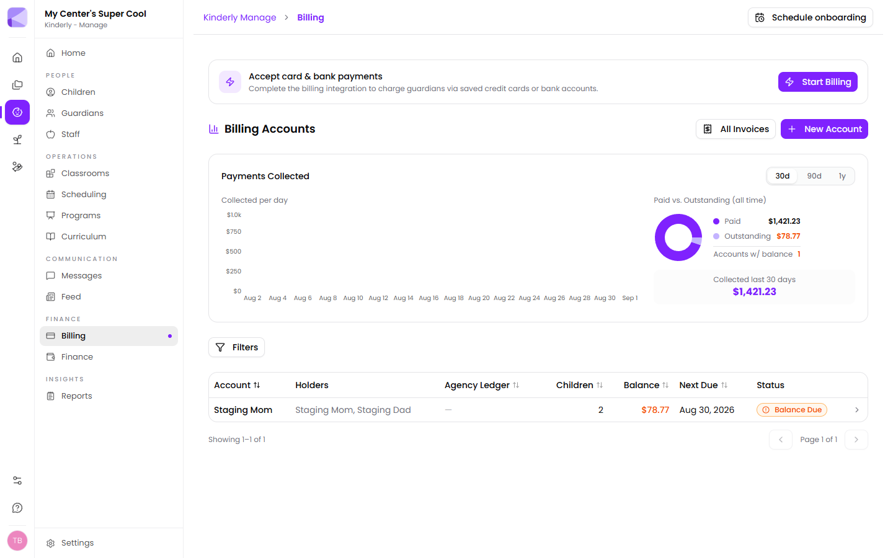

Billing handles money coming **in** from families. (Your own operating spend is [Finance](/manage/finance/).)

## Turning on payments

Until you complete setup, a banner offers **Start Billing**. Completing it lets you charge guardians via saved credit cards or bank accounts.

You can run billing without it — issuing invoices and recording what families pay by cash or transfer — but families can't pay in-app.

## Billing accounts

A **billing account** is who gets the invoice. It can have several **holders** (both parents, say) and cover several children, so a family gets one invoice rather than one per child.

**New Account** creates one. Children are attached from their own [record](/manage/children/#billing).

:::tip[One account per family, not per child]
Siblings on one account means one invoice, one balance and one payment. Separate accounts per child means a family reconciling three payments a month and you chasing three balances.
:::

## The dashboard

- **Payments Collected** — a per-day chart over 30 days, 90 days or a year
- **Paid vs. Outstanding** — all-time totals, and how many accounts carry a balance
- **Collected last 30 days**

## The accounts table

Each row shows the account, its holders, agency ledger, number of children, balance, next due date and status (e.g. **Balance Due**). Sort by any column; **Filters** narrows the list.

:::tip[Sort by balance to find the real problem]
Sorting by balance, largest first, shows you where the money actually is. Working chronologically through overdue accounts means spending equal effort on a $12 balance and a $1,200 one.
:::

### Agency ledger

Where a third party — a state subsidy or agency — pays part of a child's fees, that portion is tracked separately from what the family owes.

:::caution[Split the family and agency portions properly]
If an agency covers part of a place and you bill the whole amount to the family, you'll chase parents for money they don't owe. The agency ledger exists so the family's balance is genuinely what the family owes.
:::

## Invoices

**All Invoices** lists every invoice raised. Charges come from the [program](/manage/programs/) a child is enrolled in, with any **Program Fee Overrides** on the child's record applied automatically.

## Tax statements

Families download tax statements from the [Parents app](/mobile/parent-app/). These carry your **Tax ID (EIN/TIN)** and **Provider Number (DVN)** from [Settings](/manage/settings/).

:::tip[Fill in your Tax ID and Provider Number before January]
Parents need these for childcare tax credits, and they all want them at once. Left blank, the fields are simply omitted from the statement — and you'll spend January answering the same question by email.
:::

## Next

- [Programs](/manage/programs/) — where fees are defined.
- [Finance](/manage/finance/) — money going out.
