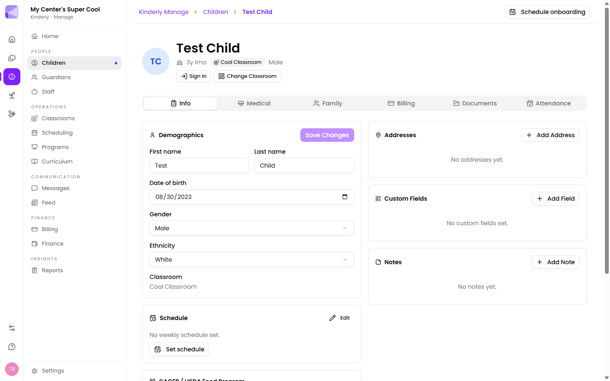
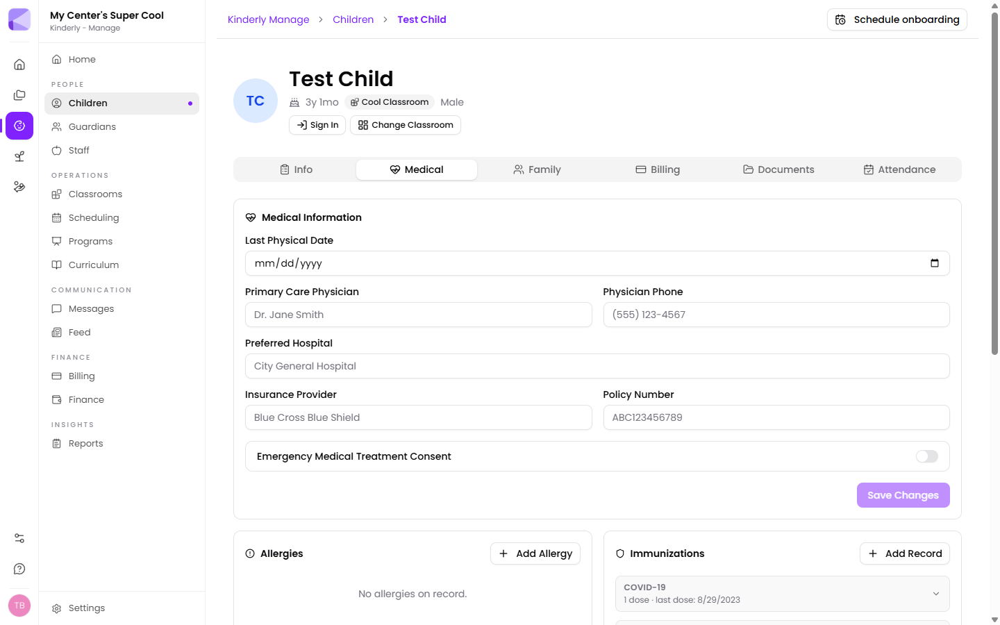

The child record is the centre of Manage. Everything else — attendance, billing, reports, the [Parents app](/mobile/parent-app/) — reads from it.

## The list

**Manage → Children** shows everyone, with classroom, age, sign-in state and status.

- **Add Child** creates a record.
- **Filters** narrows by classroom, status and more.
- Tick the checkboxes to act on several children at once.
- The **⋮** menu on each row holds per-child actions.

## The record

Opening a child gives you their photo, age, classroom and a **Sign In** button for manual attendance, plus **Change Classroom**. Below that, six tabs.

### Info

- **Demographics** — name, date of birth, gender, ethnicity, classroom.
- **Schedule** — the child's expected weekly pattern. Set this and Kinderly can tell you when a child is here on an unscheduled day, or missing on a scheduled one.
- **CACFP / USDA Food Program** — program type (Free, Reduced, Paid, Base, Non-Needy), race/ethnicity for reporting, and IE form start and end dates.
- **Addresses**, **Custom Fields**, **Notes**.

:::tip[Set the weekly schedule even for full-time children]
It feels redundant when a child is in five days a week, but the schedule is what powers the [Child Schedule Adherence report](/manage/reports/) and unscheduled-attendance flags. Without it, Kinderly has no expectation to compare reality against.
:::

:::note[CACFP fields are for food program claims]
If you claim under the USDA Child and Adult Care Food Program, these feed the [CACFP reports](/manage/reports/). If you don't participate, leave them alone.
:::

### Medical

- **Medical Information** — last physical, primary care physician and phone, preferred hospital, insurance provider and policy number, and an **Emergency Medical Treatment Consent** toggle.
- **Allergies** — pulled from the list you define in [Settings](/manage/settings/).
- **Immunizations** — dose counts and last-dose dates per vaccine.

:::caution[Emergency Medical Treatment Consent is a toggle, and it defaults to off]
This is the permission you'd rely on in an actual emergency. It won't fill itself in from a form a parent signed. Check it's set for every child.
:::

:::tip[Define allergies and immunisations in Settings first]
Both lists come from [Manage → Settings](/manage/settings/). Setting them up before adding children means everyone records "Peanut" the same way, instead of "peanuts", "nut allergy" and "PEANUT" — which is the difference between a filter that works and one that doesn't.
:::

### Family

Guardians attached to this child, each with their relationship, contact details, and **Primary** / **Can Pick Up** flags. Siblings at the centre are listed too, with the guardian they share.

:::caution["Can Pick Up" is the one to get right]
It's the flag that answers "is this person allowed to collect this child?". Being a guardian and being authorised for pickup aren't the same thing — custody arrangements, in particular, depend on the distinction.
:::

### Billing

- **Billing Account** — the account this child's fees go to. Assign an existing one or create a new one.
- **Program Fee Overrides** — change which fees apply to this child and at what amount. Applied automatically at billing time.

:::tip[Overrides beat separate programs]
For a staff discount or a sibling rate, override the fee on the child rather than creating a near-duplicate program. One program stays one program, and the exception lives where you'll actually look for it.
:::

### Documents

Files uploaded against this child, plus **Shared Documents** — [shares](/shares/overview/) linked to this child, so a signed enrollment packet is attached to the right record instead of sitting only in the Shares list.

### Attendance

Every sign-in and sign-out, with time, who signed, notes and captured signature. **Add Entry** records attendance by hand for a missed sign-in.

## Next

- [Guardians](/manage/guardians/) — the families behind the children.
- [Settings](/manage/settings/) — allergy, immunisation and custom-field lists.
