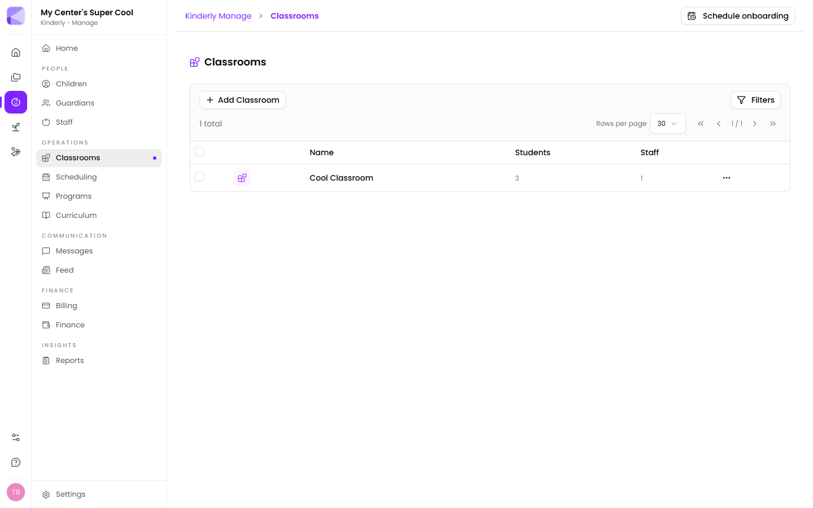

**Manage → Classrooms** lists each room with its student and staff counts. **Add Classroom** creates one.

## What a classroom does

A classroom isn't just a label. It's the unit Kinderly uses for:

- **Ratios** — the required staff-to-child ratio, and whether you're meeting it
- **Out-of-ratio alerts** — pushed to the [Teachers app](/mobile/teacher-app/) when a room drops below requirement during operating hours
- **Attendance and name-to-face checks** — done per room
- **Reporting** — attendance, name-to-face and curriculum reports break down by room

## Ratios

Required ratios are set in **[Settings → Class Ratios](/manage/settings/)**, usually by age group to match your licensing requirements.

Kinderly counts **who is signed in**, not who is enrolled or assigned. An empty room with three children on its roster isn't out of ratio, and a room whose staff member forgot to sign out looks staffed when it isn't.

:::caution[Ratio alerts are only as good as your sign-ins]
The whole mechanism rests on staff and children signing in and out reliably. If your team is casual about it, the alerts will be wrong in both directions — and a false alarm teaches people to ignore the real one.
:::

## Moving children between rooms

Use **Change Classroom** on a [child's record](/manage/children/), or plan moves ahead through the **Transitions** tab in [Scheduling](/manage/scheduling/).

:::tip[Use Transitions for age-ups]
Moving a child by hand on their birthday works until you have thirty of them. Transitions lets you plan the move in advance so the room counts and ratios are right on the day, without you remembering.
:::

## How many rooms to create

Create the rooms you actually operate, not every grouping you can imagine. Ratios, alerts and reports all key off this, so rooms that don't correspond to a real physical space with real assigned staff produce noise.

## Next

- [Scheduling](/manage/scheduling/) — staffing rooms and planning transitions.
- [Settings](/manage/settings/) — setting ratio requirements.
