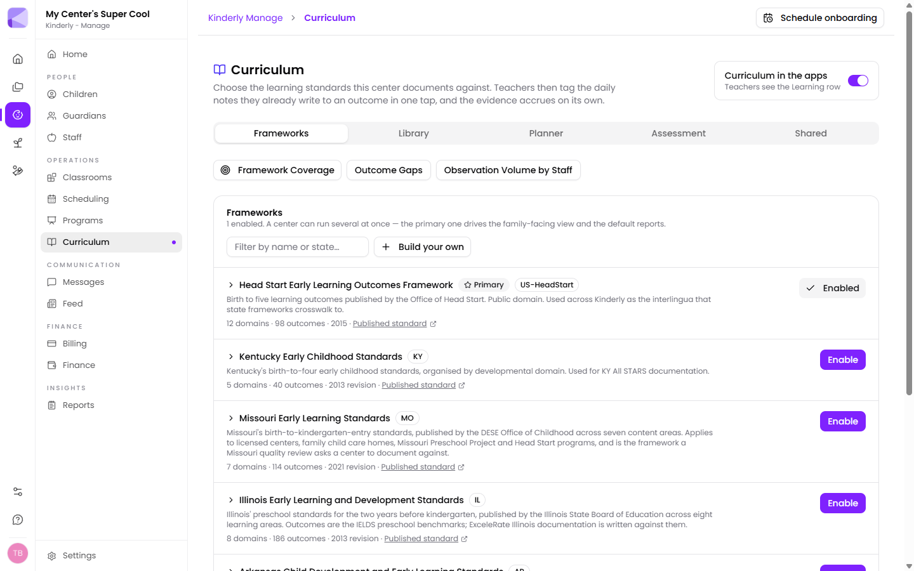

Curriculum is how Kinderly turns the notes your teachers already write into documented evidence against recognised learning standards — without asking them to do a second, separate job.

The principle: teachers tag a daily note to a learning outcome in one tap, and the evidence accrues on its own.

## Frameworks

A framework is a published set of learning standards. **Manage → Curriculum → Frameworks** shows what's available and what you've enabled.

Kinderly ships with **Head Start Early Learning Outcomes Framework (ELOF)** — birth-to-five outcomes from the Office of Head Start, public domain, 12 domains and 98 outcomes. A library of state frameworks sits alongside it — Kentucky, Missouri, Illinois, Arkansas and more, each with its domain and outcome counts and a link to the published standard. You can also **Build your own**.

Each framework says what it's used for, which makes picking easier: Missouri's, for example, is "the framework a Missouri quality review asks a center to document against".

ELOF does double duty: it's the common language other frameworks crosswalk to. Tag an observation once and it can count toward both ELOF and your state's standards.

### Running more than one

You can enable several at once. One is marked **Primary** — it drives the family-facing view and the default reports.

:::tip[Enable your state framework, keep ELOF primary]
If you report to a state QRIS (KY All STARS, for instance), enable that framework so the documentation matches what your assessor expects. Leaving ELOF primary keeps the crosswalk working and your reports consistent.
:::

:::caution[More frameworks isn't better]
Every enabled framework is another set of outcomes teachers see when tagging. Enable the ones you actually report against — not everything that looks relevant.
:::

## The tabs

- **Frameworks** — choose and configure standards.
- **Library** — activities mapped to outcomes.
- **Planner** — plan activities across the week.
- **Assessment** — where each child sits against the outcomes.
- **Shared** — material shared across your centre.

## Insight panels

Three views sit above the tabs:

- **Framework Coverage** — how much of the framework your documentation actually touches.
- **Outcome Gaps** — outcomes with little or no evidence.
- **Observation Volume by Staff** — who's contributing observations.

:::tip[Outcome Gaps is the one to check before an assessment visit]
It tells you exactly which outcomes are thin. Filling three specific gaps in the weeks before a visit is far more effective than asking everyone to "write more observations".
:::

:::note[Observation Volume by Staff is about support, not scoring]
It's genuinely useful for spotting a teacher who needs help with the tagging workflow. It makes a poor performance metric — the teacher writing the most observations isn't necessarily writing the most useful ones.
:::

## How teachers use it

In the [Teachers app](/mobile/teacher-app/) staff see a **Learning** row on the notes they already write. Tagging an observation to an outcome takes one tap.

That's the whole design: no separate curriculum system to keep up to date, because the documentation is a by-product of daily practice.

The **Curriculum in the apps** toggle, top-right of the Curriculum screen, controls whether that Learning row appears for teachers at all.

:::tip[Set your frameworks before turning the apps on]
Switch the Learning row on before you've chosen your frameworks and teachers get a tagging prompt with nothing sensible to tag against — which teaches them to ignore it. Enable your frameworks first, then turn it on and tell the team what changed.
:::

## Next

- [Reports](/manage/reports/) — curriculum reporting.
- [Teacher app](/mobile/teacher-app/) — where observations are captured.
