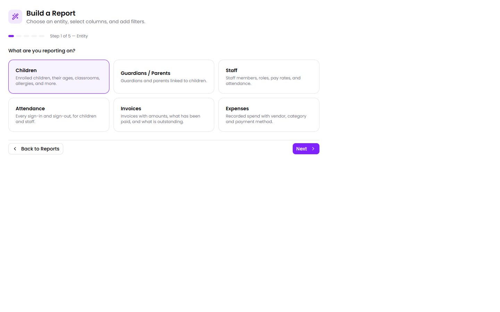
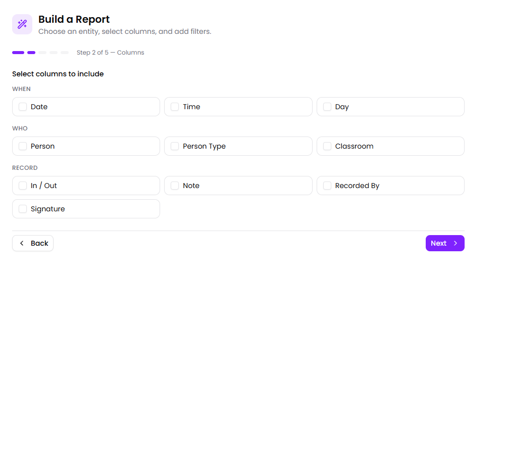
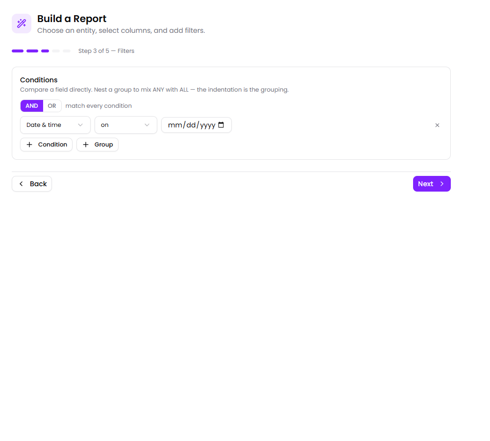
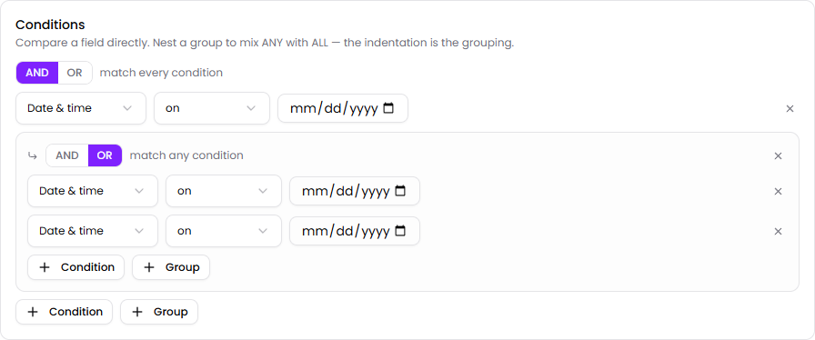
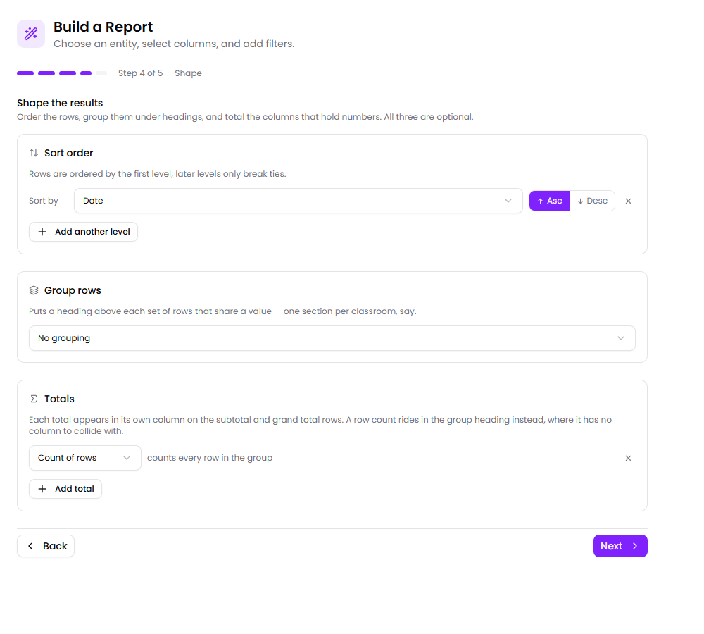

The [pre-built reports](/manage/reports/) cover the questions most centers are asked most often. The **report builder** is for the rest: the funder who wants spend by category for one quarter, the board member who wants headcount by room, the licensing visit that wants every late pickup since March.

You build a report once, save it, and re-run it whenever you need it.

:::tip[Start from a pre-built report where one fits]
The builder is powerful but it is more work. If a pre-built report already answers the question, run that instead — and if it *almost* answers it, check whether a date range or classroom filter gets you there before building something new.
:::

## The five steps

The builder walks through five steps. You can move back and forward freely, and nothing is saved until you choose to save it.

### Step 1 — What are you reporting on?

Every report starts from one kind of record. This choice decides which columns and filters are available for the rest of the build, so it's worth getting right first.

| Start from | One row per | Reach for it when |
|---|---|---|
| **Children** | Enrolled child | Rosters, allergy and immunization lists, anything about who is enrolled |
| **Guardians / Parents** | Guardian | Contact lists, employer details, who to call |
| **Staff** | Staff member | Team lists, pay rates, hire and termination dates, certifications |
| **Attendance** | Sign-in or sign-out | Late pickups, who was in on a given day, attendance patterns |
| **Invoices** | Invoice | Outstanding balances, what was billed for a period, payment status |
| **Expenses** | Recorded expense | Spend by vendor or category, month-on-month cost tracking |

The difference matters more than it looks. A report about **Children** gives you one line per child — so a child who attended twenty days is still one line. A report about **Attendance** gives you one line per sign-in — so that same child is twenty lines. If you're counting *events*, start from Attendance; if you're listing *people*, start from Children.

:::note[Children, Guardians and Staff can pull in related records]
Those three can also include things like allergies, immunizations, guardians or certifications as extra columns. Attendance, Invoices and Expenses are single records with nothing hanging off them, so that section doesn't appear for them.
:::

### Step 2 — Choose your columns

Tick the columns you want. They're grouped to make them easier to find — an Attendance report offers **When**, **Who** and **Record**, for instance.

Pick fewer than you think you need. A report with eight columns prints cleanly on one page; a report with twenty needs landscape and small type, and nobody reads the columns on the right.

### Step 3 — Narrow it down

Filters decide which records appear. Add a condition, choose a field, choose how to compare it, and type a value.

The comparisons available depend on the kind of field:

| Kind of field | What you can ask |
|---|---|
| Text | is, is not, contains, does not contain, starts with, ends with, is empty, is not empty |
| Number | =, ≠, >, ≥, <, ≤, between, is empty, is not empty |
| Date | on, on or after, on or before, between, is empty, is not empty |
| Yes / no | is |

**Is empty** and **is not empty** are more useful than they sound. "Immunization date is empty" is your list of children with a gap in their records — the one a licensing inspector will ask for.

#### Matching any instead of all

By default a report shows records matching **every** condition — that's the **AND** setting. Switch it to **OR** and it shows records matching **any** of them.

When you need both at once, add a **group**. A group is a set of conditions with its own AND/OR setting, and it sits indented inside the outer set:

The indentation is the grouping. The example above reads:

> the first condition **AND** (either of the two indented ones)

That's how you ask for something like "signed out after 6pm **and** (in the Toddler room **or** the Pre-K room)". Without the group you could only ask for all three at once, or any of the three — neither of which is the question.

:::caution[A half-finished condition is ignored]
A condition with no value typed in doesn't narrow anything — the report runs as though it weren't there, rather than returning nothing. If a report is showing more than you expect, check for a condition you started and didn't finish.
:::

### Step 4 — Shape the results

This is where a list becomes a report. All three parts are optional.

**Sort order** — rows are ordered by the first level you add. Add a second level and it only breaks ties in the first: sort by Classroom, then by Name, and you get each room's children alphabetically. Blank values always sort to the bottom, whichever direction you choose, so a list sorted by expiry date doesn't open with everyone who has no date on file.

**Group rows** — puts a heading above each set of rows sharing a value. Group an attendance report by Classroom and you get a section per room. Two extra options:

- **Show a subtotal row under each group** — a totals line at the end of each section.
- **Summary only** — drops the detail rows and keeps just the headings and totals. One line per classroom instead of one line per child. This is usually what a board report wants.

**Totals** — count, sum, average, minimum, maximum, or a count of distinct values. Each total appears in the column it summarises, on the subtotal and grand total rows. A plain row count appears in the group heading instead — "Classroom: Pre-K (12)" — where it has no column to collide with.

:::tip[Totals only work on columns that hold numbers]
Summing a Name column gives you nothing, sensibly. Money columns work fine — the total sees through the "$" and the commas.
:::

### Step 5 — Save and run

Give the report a name, optionally a description and a category, then run it. Saving it means you can re-run it any time from the Reports screen without rebuilding it.

## Worked examples

### Late pickups by classroom, last month

1. **Attendance**
2. Columns: Date, Time, Person, Classroom
3. Conditions: *In / Out* **is** `SignOut`, **and** *Date & time* **between** the first and last of the month
4. Shape: group by **Classroom**, add a **Count of rows**
5. Save as "Late pickups — monthly"

Each room becomes a section with a count in its heading.

### What families still owe

1. **Invoices**
2. Columns: Invoice #, Account, Due Date, Amount, Amount Paid, Balance
3. Conditions: *Status* **is not** `paid`
4. Shape: sort by **Due Date** ascending, add a **Sum** of **Balance**
5. Save as "Outstanding balances"

Oldest debt first, with the total owed on the last line.

### Spend by category for a quarter

1. **Expenses**
2. Columns: Date, Vendor, Category, Amount
3. Conditions: *Date* **between** the quarter's first and last day
4. Shape: group by **Category**, tick **Summary only**, add a **Sum** of **Amount**
5. Save as "Quarterly spend by category"

One line per category with its total — the shape a funder or accountant asks for.

:::note[Filtering on an amount]
Amount filters are entered in cents, and the field is labelled that way: `5000` means $50.00. The amounts *shown* in the report are ordinary dollars.
:::

## Printing and exporting

Every report — pre-built or custom — can be printed or exported from the results screen.

- **Print** picks the orientation and type size to fit the columns, repeats the column headings on every page, and won't split a row across a page break.
- **Export to… → CSV** opens in Excel or Google Sheets, with group headings and total labels preserved.
- **Export to… → PDF** produces a paginated file with the report title and date on every page and page numbers in the footer.

:::note[Names in exported PDFs]
The PDF uses a standard document font that covers Latin alphabets. A name written in a script outside that — Arabic or Chinese, for instance — is replaced with question marks in the PDF. The CSV export keeps the name exactly as entered, so use CSV where that matters.
:::

## Tips

- **Build it once, save it.** Board reports, funder returns and licensing packs are the same query every month.
- **Star the ones you use.** A star on a report card puts it at the top of the Reports screen. Stars are personal — yours don't change anyone else's.
- **Check the row count.** It's shown under the report title. If it looks wrong, the usual cause is an unfinished condition or a filter that's narrower than you meant.
- **A very large report is capped.** A report over a long period with no filters returns the first several thousand records rather than everything. Add a date range to get a report you can actually read.

## Next

- [Reports](/manage/reports/) — the pre-built set.
- [Children](/manage/children/) — where most report data originates.
- [Finance](/manage/finance/) — expense tracking that feeds the Expenses reports.
