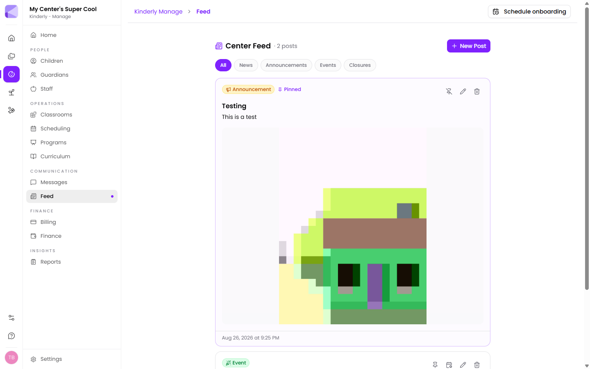

The **Center Feed** is what families see in the [Parents app](/mobile/parent-app/). It's for things everyone should know, as opposed to [Messages](/manage/messages/), which is for conversations with one family.

## Post types

| Type | For |
|---|---|
| **News** | General updates — a new staff member, a room refresh |
| **Announcements** | Things families need to act on or remember |
| **Events** | Something happening at a date and time |
| **Closures** | Days you're shut |

Filter tabs at the top let you view one type at a time.

## Creating a post

**New Post** opens the composer. Posts take **photos and video** — up to 20 attachments each, 200 MB per clip. Families see video play inline, with a still frame while it loads.

Staff can also post straight from the [Teachers app](/mobile/teacher-app/).

## Pinning

A post can be **pinned** to stay at the top of the feed regardless of age.

:::tip[Pin sparingly]
One pinned post gets read. Four pinned posts are just a wall families scroll past. Pin the thing that actually matters this week and unpin it when it doesn't.
:::

## Events and closures

Events and closures carry dates rather than just being text, so families see them as *when*, not just *what*.

### Recurring

An event or closure can repeat: pick the weekdays and a date range and every occurrence is created for you, up to a year out. The feed collapses a series into a single row showing its cadence — *"Occurs every Tue & Fri"* — with the number of dates.

You can drop individual dates from a series, or delete the whole series in one click.

### All-day

Events and closures can be marked all-day, so a week-long closure reads as dates rather than times.

:::tip[Put your closure calendar in once, at the start of the year]
Public holidays, staff training days, the Christmas break — enter them as recurring or all-day closures in one sitting. Families can see the whole year, and you stop fielding "are you open on the 24th?" every December.
:::

:::caution[Closures here are separate from Settings]
Posting a closure to the feed tells families. The **Closed Holidays** list in [Settings](/manage/settings/) is what the system uses for operating days. Setting one doesn't set the other — for a genuine closure, do both.
:::

## Next

- [Messages](/manage/messages/) — talking to one family.
- [Parent app](/mobile/parent-app/) — where families read the feed.
