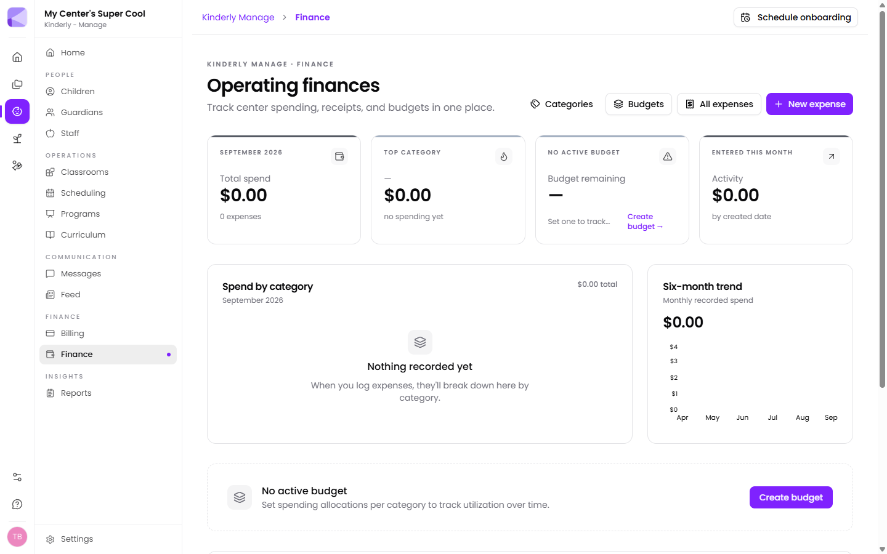

Finance is money going **out** — rent, food, supplies, wages, insurance. It's separate from [Billing](/manage/billing/), which is money coming in from families.

## The dashboard

For the current month:

- **Total spend** and the number of expenses
- **Top category** and what it came to
- **Budget remaining**, if you've set a budget
- **Activity** entered this month, by date created
- **Spend by category** breakdown
- **Six-month trend** of monthly recorded spend
- **Recent expenses**

## Logging an expense

**New expense** records one. Kinderly is built for you to attach the receipt at the same time, so the record and its evidence stay together.

:::tip[Log it when it happens, receipt and all]
The value of this is at tax time or an audit, when you need the receipt for a purchase from eight months ago. Entering expenses in a monthly catch-up session means guessing at categories and hunting for paper.
:::

## Categories

**Categories** defines your spending buckets. These drive the breakdown chart and the budget allocations.

:::tip[Fewer categories, used consistently]
Eight categories everyone applies the same way tell you more than thirty that overlap. If you can't decide between two, you have one too many.
:::

## Budgets

**Budgets** sets spending allocations per category and tracks utilisation over time. With an active budget the dashboard shows what's left rather than just what's gone.

:::tip[Budget the categories that can run away]
Food, supplies and maintenance are where an unnoticed overspend does damage. Rent doesn't need a budget — you know what it is. Budget what varies.
:::

## Finance and Billing don't talk to each other

Deliberately. Finance is your operating costs; Billing is family fees. Neither feeds the other, and there's no combined profit-and-loss view — you'd take the figures from both into your accounting software.

## Reporting

Finance data feeds the **Finance** category in [Reports](/manage/reports/).

## Next

- [Billing](/manage/billing/) — money coming in.
- [Reports](/manage/reports/) — finance reporting.
