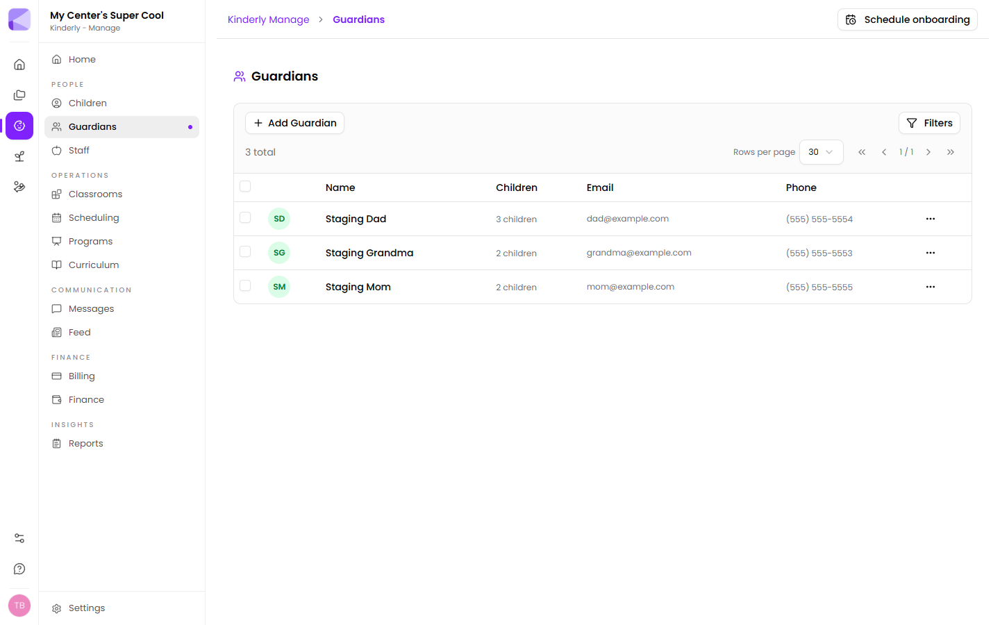

A guardian is anyone connected to a child — parents, grandparents, step-parents, childminders, emergency contacts.

**Manage → Guardians** lists them with their name, how many children they're attached to, email and phone. **Add Guardian** creates one.

## Guardians and children are many-to-many

One guardian can be attached to several children, and one child can have several guardians. That's how siblings and blended families work: a grandparent attached to two children appears once, listed against both.

:::tip[Attach, don't duplicate]
When a second child from the same family enrols, attach the existing guardian rather than creating a new one with the same details. Duplicates mean two copies of a phone number to keep current, two entries in the pickup list, and messages that go to only half the family.
:::

## Per-child settings

The relationship, **Primary** flag and **Can Pick Up** flag are set on the *link* between a guardian and a child, not on the guardian. A grandmother can be authorised for pickup for one grandchild and not another.

- **Relationship** — Father, Mother, Grandmother, and so on.
- **Primary** — the main contact for that child.
- **Can Pick Up** — authorised to collect.

:::caution[Every child needs a Primary]
The primary contact is who Kinderly treats as the default point of contact for that child. If nobody is marked primary, you're relying on whoever happens to be first in the list.
:::

## What guardians can do

A guardian's email address is their route into the [Parents app](/mobile/parent-app/), where they can see their child's day, receive [messages](/manage/messages/) and read the [feed](/manage/feed/).

It's also what appears in the recipient picker when you [send a share](/shares/sending/) — the reason picking from your centre is safer than typing an address.

:::caution[The email address is load-bearing]
It's the app login, the share recipient, and where notifications go. A typo doesn't produce an error — it produces a parent who quietly never hears from you. Worth checking at enrollment.
:::

## Billing

Guardians can hold a [billing account](/manage/billing/). An account can have more than one holder, so both parents can see and pay the same invoices.

## Next

- [Children](/manage/children/) — the records guardians attach to.
- [Messages](/manage/messages/) — talking to families.
