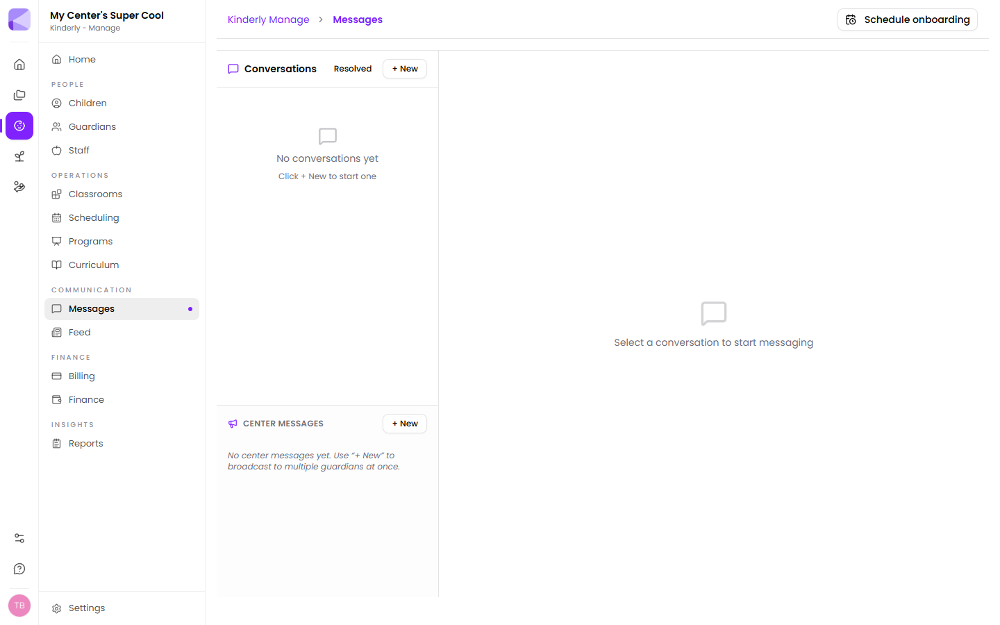

Messages is for talking *to* families. For things everyone should see, use the [Feed](/manage/feed/).

## Conversations

The left-hand panel lists your conversations, with a **Resolved** filter for ones you've closed off. **+ New** starts one.

Families reply from the [Parents app](/mobile/parent-app/), so it's a proper two-way thread rather than a send-only channel.

:::tip[Resolve threads you've finished with]
Resolved isn't deleted — it's "dealt with". Working through an inbox of genuinely open conversations is manageable; scrolling past three months of settled ones to find today's question isn't.
:::

## Center messages

**Center Messages**, below conversations, broadcasts to multiple guardians at once. Use it for something several families need but not everyone — one classroom, or the children on a particular trip.

:::note[Three ways to reach families, for three different jobs]
- **Conversation** — one family, needs a reply
- **Center message** — some families, no reply expected
- **[Feed](/manage/feed/)** — everyone, stays visible
:::

:::caution[A broadcast is a poor way to ask a question]
Replies to a broadcast come back as individual threads. Send one to sixty families asking them to confirm something and you've made sixty conversations for yourself. For anything needing a response from every family, send a [form](/forms/overview/) instead — the answers arrive collated.
:::

## Choosing the right channel

| You want to… | Use |
|---|---|
| Answer one parent's question | Conversation |
| Tell one classroom about a trip | Center message |
| Announce a closure | [Feed](/manage/feed/) closure post |
| Share photos of the day | [Feed](/manage/feed/) post |
| Collect a reply from every family | [Form](/forms/overview/) |

## Next

- [Feed](/manage/feed/) — the centre noticeboard.
- [Parent app](/mobile/parent-app/) — where families read and reply.
