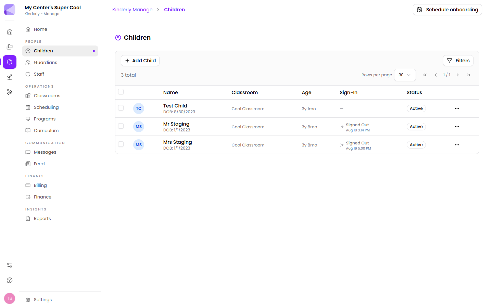

Where [Enroll](/forms/overview/) handles getting families in, **Manage** is everything after: who's in your care, who looks after them, when they're here, what you charge, and what you have to report.

The left-hand menu groups it into five areas.

## People

- **[Children](/manage/children/)** — the child record: demographics, medical, family, billing, documents and attendance.
- **[Guardians](/manage/guardians/)** — parents, carers and anyone else attached to a child.
- **[Staff](/manage/staff/)** — your team, their roles and their hours.

## Operations

- **[Classrooms](/manage/classrooms/)** — rooms, who's in them, and staffing.
- **[Scheduling](/manage/scheduling/)** — staff shifts, children's expected days, and room transitions.
- **[Programs](/manage/programs/)** — what you offer and what it costs.
- **[Curriculum](/manage/curriculum/)** — learning frameworks and observation records.

## Communication

- **[Messages](/manage/messages/)** — one-to-one conversations with families, and center-wide broadcasts.
- **[Feed](/manage/feed/)** — your center's noticeboard: news, announcements, events and closures.

## Finance

- **[Billing](/manage/billing/)** — charging families, invoices and balances.
- **[Finance](/manage/finance/)** — your own operating spend, receipts and budgets.

:::note[Two different money screens]
**Billing** is money coming *in* from families. **Finance** is money going *out* to run the center. They're deliberately separate and don't feed into each other.
:::

## Insights

- **[Reports](/manage/reports/)** — pre-built and custom reports across attendance, health, curriculum, CACFP and finance.

## Setting up

**Settings** at the bottom of the menu covers the center itself — name, address, hours, ratios, allergy and immunisation lists, custom fields. Get these right before adding children; several of them shape what a child's record can hold. See [Settings](/manage/settings/).

:::tip[Set up in this order]
1. **Settings** — center info, hours, ratios, allergy and immunisation lists
2. **Classrooms** — the rooms you actually run
3. **Staff** — your team, assigned to rooms
4. **Programs** — what you offer and what it costs
5. **Children and guardians** — last, so there's something to slot them into

Adding children first means going back over every record to assign rooms and programs afterwards.
:::

## Onboarding help

**Schedule onboarding**, top-right on every Manage screen, books a session with the Kinderly team. **Settings → Launch Setup Wizard** walks you back through the basics on your own.

## Next

- [Settings](/manage/settings/) — configure your center first.
- [Children](/manage/children/) — the heart of the system.
