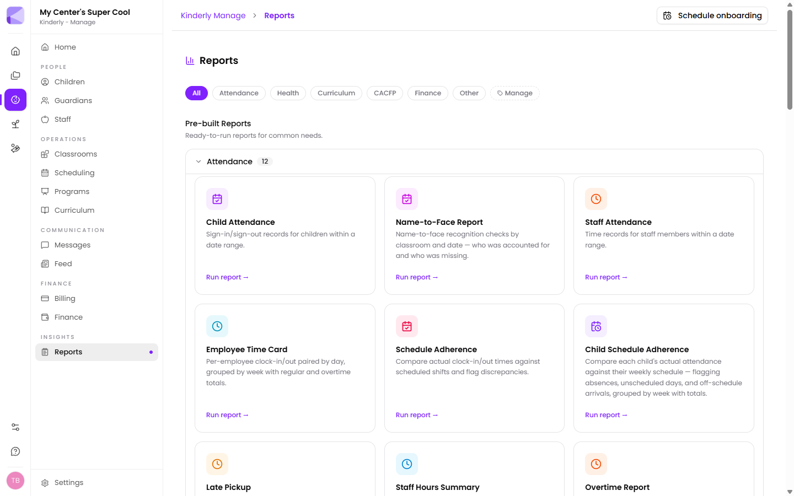

Reports is where the data you've been entering turns into something you can hand to a licensing inspector, a food program auditor, or your accountant.

## Categories

Reports are grouped as **Attendance**, **Health**, **Curriculum**, **CACFP**, **Finance**, **Other** and **Manage**, with **All** showing everything.

## Attendance reports

The largest group. Among them:

| Report | What it gives you |
|---|---|
| **Child Attendance** | Sign-in/sign-out records over a date range |
| **Name-to-Face Report** | Name-to-face checks by classroom and date — who was accounted for, who was missing |
| **Staff Attendance** | Staff time records over a date range |
| **Employee Time Card** | Clock-ins paired by day, grouped by week, with regular and overtime totals |
| **Schedule Adherence** | Actual staff clock times against scheduled shifts, discrepancies flagged |
| **Child Schedule Adherence** | Each child's attendance against their weekly schedule — absences, unscheduled days, off-schedule arrivals |
| **Late Pickup** | Children signed out after close |

:::tip[Name-to-Face is your licensing evidence]
Most inspections want to see that you know which children are physically present, not just enrolled. This report is that evidence, already in the format an inspector expects.
:::

:::tip[Late Pickup is a billing report in disguise]
If you charge late fees, run it monthly and you have the backing for every charge — rather than relying on someone's memory of who was twenty minutes late in the second week.
:::

## Running a report

Pick a report, set the date range and any filters, and **Run report**.

## Custom reports

Beyond the pre-built set there's a **report builder** for questions the standard reports don't answer. It can start from children, guardians, staff, attendance, invoices or expenses; filter on any combination of fields; and group and total the results. Saved reports re-run from this screen with one click.

See [Building custom reports](/manage/custom-reports/) for a full walkthrough.

:::tip[Save the ones you run monthly]
Board reports, funder returns and licensing packs tend to be the same query every month. Building it once and saving it turns a half-hour job into one click.
:::

## Favorites

The star on a report card pins it to a **Favorites** section at the top of this screen. Stars are personal — starring a report doesn't change what anyone else sees. There's also a search box that looks across both the pre-built and saved reports.

## CACFP

If you claim under the USDA food program, the CACFP reports draw on the food program fields on each [child's record](/manage/children/#info). They're only as good as those fields — a child without a program type set won't appear correctly.

## Next

- [Children](/manage/children/) — where most report data originates.
- [Finance](/manage/finance/) — spend reporting.
