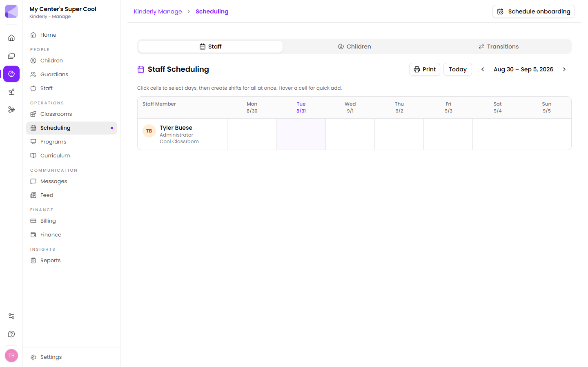

**Manage → Scheduling** has three tabs: **Staff**, **Children** and **Transitions**.

## Staff scheduling

A week grid, staff down the side and days across the top. Each staff member shows their role and classroom.

- Hover a cell for a quick add.
- Click cells to select several days, then create shifts for all of them at once.
- Each cell offers **Shift** or **Time Off**.
- **Today** returns to the current week; the arrows move between weeks.
- **Print** produces a copy for the staff room wall.

:::tip[Select the whole week, then create once]
For someone on a fixed pattern, click all five cells and create the shift in one go rather than five times. Multi-select is the difference between scheduling a team in minutes and in half an hour.
:::

## Why shifts matter beyond the rota

Scheduled shifts are what **Schedule Adherence** compares actual clock-in and clock-out times against. Without them there's nothing to compare to, and the report has nothing to say.

:::tip[Record time off properly]
Marking time off rather than leaving a cell blank is what stops a planned absence looking like a no-show in adherence reporting.
:::

## Children's schedules

The **Children** tab shows each child's expected weekly pattern — the same schedule that appears on their [record](/manage/children/).

This is what powers the **Child Schedule Adherence** report, which flags absences, unscheduled days and off-schedule arrivals.

:::tip[This is your part-time attendance check]
For part-time children the schedule is how Kinderly knows a Tuesday absence matters and a Wednesday one doesn't, because they were never due in. Without it, every non-attendance looks the same.
:::

## Transitions

Planned moves between [classrooms](/manage/classrooms/) — typically children ageing up.

Scheduling a transition in advance means the move happens on the right date, and room counts and ratios stay correct without anyone remembering on the morning.

:::tip[Plan transitions at enrollment]
You already know roughly when a child ages out of the infant room. Setting the transition when they join means it happens on time, and your room capacity forecasts are right months ahead.
:::

## Next

- [Staff](/manage/staff/) — the team you're scheduling.
- [Reports](/manage/reports/) — adherence and attendance reporting.
