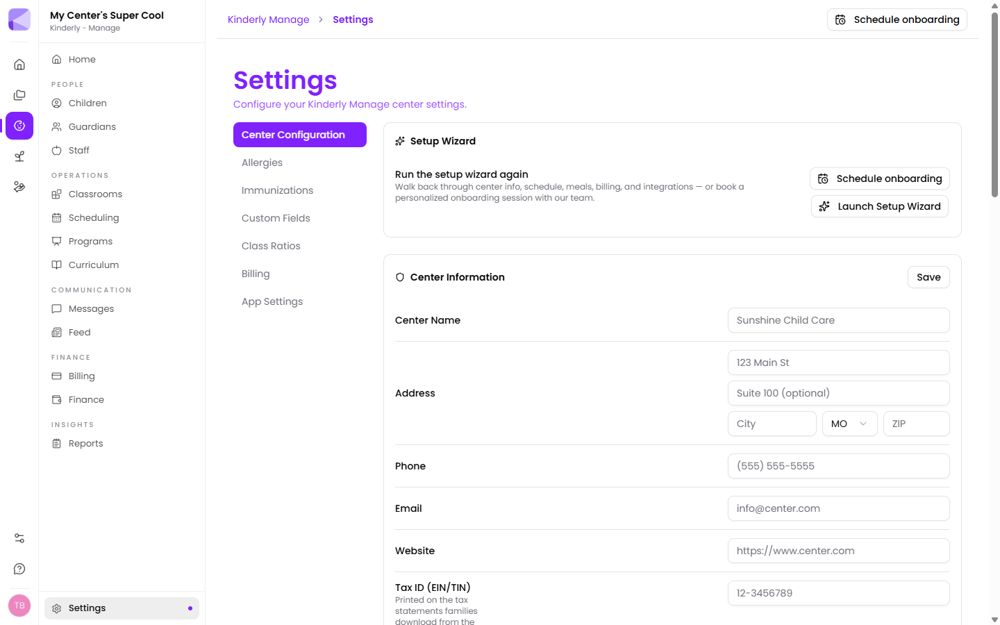

**Manage → Settings** configures the centre itself. Worth doing before you add children, since several of these lists shape what a child's record can hold.

Tabs: **Center Configuration**, **Allergies**, **Immunizations**, **Custom Fields**, **Class Ratios**, **Billing**, **App Settings**.

## Setup wizard

**Launch Setup Wizard** walks you back through centre info, schedule, meals, billing and integrations. Useful when you've inherited a part-configured centre and want to check nothing's missing.

## Center Information

Name, address, phone, email, website, time zone — plus two that matter more than they look:

- **Tax ID (EIN/TIN)** — printed on the tax statements families download from the [Parents app](/mobile/parent-app/). Left blank, it's omitted.
- **Provider Number (DVN)** — your state-issued childcare provider number, also on family tax statements.

:::tip[Fill in the tax fields now, not in January]
Parents need both for childcare tax credits and they all ask in the same fortnight. Two minutes here saves a month of emails.
:::

## Operating Schedule

Opening and closing time, which days you're open, and **Closed Holidays**.

These define your operating hours, which is when [out-of-ratio alerts](/manage/classrooms/) run and what **Late Pickup** is measured against.

Federal holidays are offered as a checklist. **Custom Closures** covers the one-off days specific to your centre — a staff training day, a local holiday, the week between Christmas and New Year.

:::caution[Closed Holidays here is separate from a Feed closure post]
This list is what the system treats as non-operating days. A [Feed](/manage/feed/) closure post is what *tells families*. For a real closure you want both.
:::

## Meal Schedule

Set the meals you serve and when. Turn off any you don't offer, add your own, and drag the handle to reorder them.

:::tip[Get this right if you claim CACFP]
Meal times underpin the food program records that feed your [CACFP reports](/manage/reports/). A centre serving an afternoon snack that isn't configured has a gap in its claim.
:::

## Auto Sign-Out

Automatically signs out anyone still signed in at a time you set — with **separate times for children and staff**.

:::tip[This is the fix for the ratio-alert problem]
Forgotten sign-outs are the main reason [out-of-ratio alerts](/manage/classrooms/) go wrong: a staff member who left at 3pm but never signed out makes a room look covered all evening. Auto sign-out closes those off every night, so tomorrow starts from a clean state.
:::

:::caution[Set it after close, not at close]
Sign-out time is when Kinderly gives up waiting, not when you shut. Setting it at your closing time will sign out a child whose parent is running ten minutes late — and that's exactly the pickup you'd want an accurate record of. Leave a margin.
:::

## Integrations

**KinderConnect** is enabled here — it syncs attendance to state subsidy agencies. See [KinderConnect](/integrations/kinderconnect/).

## Data Tools

**Import Data** bulk-imports children, guardians and staff from an Excel spreadsheet or CSV.

:::tip[Use the importer when you're moving in]
Typing in 40 children, their guardians and the links between them is a day's work and an invitation to typos. If you're migrating from another system or from spreadsheets, import instead — and do it before you start assigning classrooms and programs.
:::

## Allergies and Immunizations

Define the lists your [child records](/manage/children/) pick from.

:::tip[Set both up before adding children]
These are pick-lists for a reason. Left to free text, one child has "Peanut", another "peanuts", a third "nut allergy" — and no filter or report can reliably tell you which children in the room have a nut allergy. That's a question you want answered correctly.
:::

## Custom Fields

Extra fields on the child record for whatever your centre tracks that Kinderly doesn't have out of the box — a bus route, a locker number, a cultural or dietary note.

:::tip[Custom fields, not notes, for anything you'll filter on]
Notes are fine for prose. If it's something you'll want to search, filter or report on, it needs to be a field.
:::

## Class Ratios

Required staff-to-child ratios, usually by age group to match licensing. These drive ratio calculations and [out-of-ratio alerts](/manage/classrooms/).

:::caution[Enter your licensing ratios, not your aspirations]
These generate real-time alerts to staff. Setting them tighter than your licence requires produces alerts your team learns to dismiss — which is exactly what you don't want when a genuine one arrives.
:::

## Billing

Centre-level billing configuration. See [Billing](/manage/billing/).

## App Settings

Controls for what families and staff see in the [Parents](/mobile/parent-app/) and [Teachers](/mobile/teacher-app/) apps.

## Next

- [Classrooms](/manage/classrooms/) — set rooms up next.
- [Children](/manage/children/) — once the lists exist.
