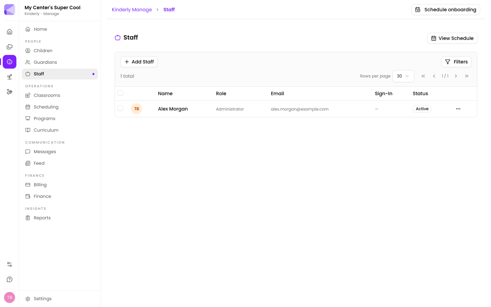

**Manage → Staff** lists your team with role, email, sign-in state and status. **Add Staff** adds someone; **View Schedule** jumps to [Scheduling](/manage/scheduling/).

## Roles

A staff member's role sets what they can do. **Administrator** is full access. Give people the narrowest role that lets them do their job.

:::tip[Not everyone needs to be an Administrator]
It's the fastest way to set someone up and the easiest to regret. Administrators can change billing, delete records and alter center settings. A room lead needs none of that.
:::

## Staff and classrooms

Staff are assigned to [classrooms](/manage/classrooms/). This drives:

- **Ratio calculations** — who counts toward staffing in a room.
- **Out-of-ratio alerts** — Kinderly watches rooms during operating hours and alerts staff in the [Teachers app](/mobile/teacher-app/) when a room drops below its required ratio. It counts who is actually *signed in*, not who's on the roster.
- **Scheduling** — shifts are set per staff member and shown by room.

:::caution[Ratio alerts count sign-ins, not assignments]
Assigning someone to a room isn't enough — they have to be signed in to count. A staff member who forgets to sign in makes the room look understaffed, and one who forgets to sign out makes it look covered when they've gone home.
:::

## Attendance and hours

Staff sign in and out like children do, and those records feed the [reports](/manage/reports/):

- **Staff Attendance** — time records over a date range
- **Employee Time Card** — clock-ins paired by day, grouped by week, with regular and overtime totals
- **Schedule Adherence** — actual times against scheduled shifts, with discrepancies flagged

:::tip[Time Card is the one for payroll]
It's already grouped by week with overtime separated out, which is usually what payroll wants. Staff Attendance is the raw record — better for answering "was she here on the 14th?".
:::

## Removing someone

Set a departing staff member to inactive rather than deleting them. Deleting takes their attendance history with it, and that history is what your time records and ratio evidence rest on.

## Next

- [Classrooms](/manage/classrooms/) — assigning staff to rooms.
- [Scheduling](/manage/scheduling/) — shifts and time off.
