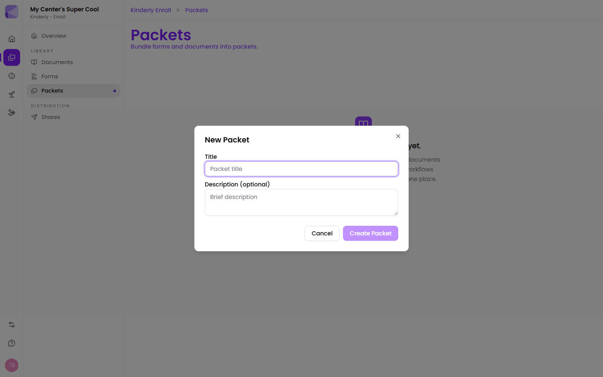
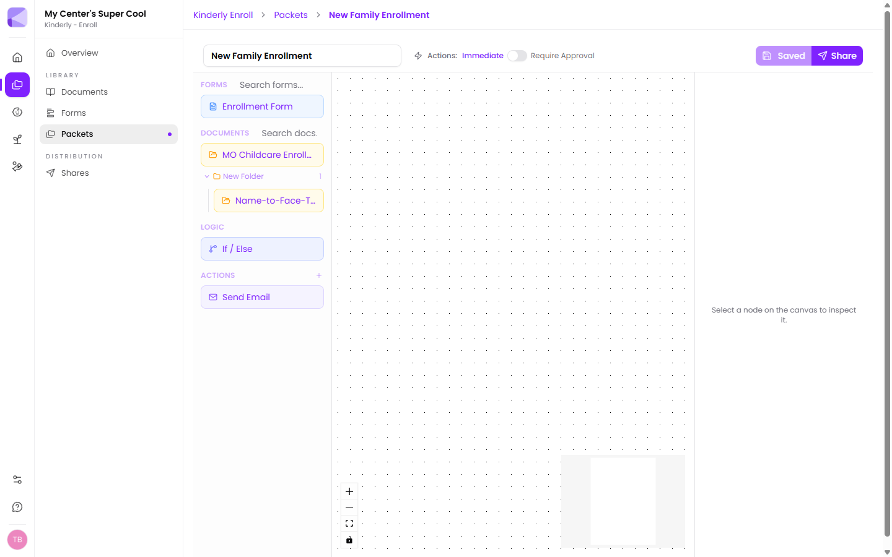
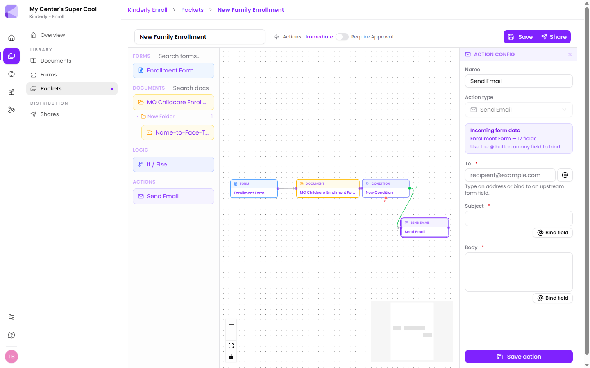

Before you start, build the [forms](/forms/building-a-form/) and upload the [documents](/documents/managing-files/) you want to include — the packet canvas can only pick from what already exists in your library.

## 1. Create the packet

Go to **Enroll → Packets** and click **New Packet**. Give it a title and an optional description.

:::tip[Name it for the family, not for you]
The title is what families see at the top of their link. "New Family Enrollment" reads better to a parent than "2026 Intake v3 FINAL".
:::

## 2. Find your way around the canvas

- **The palette** (left) — everything you can add, grouped into **Forms**, **Documents**, **Logic** and **Actions**. Forms and Documents each have a search box, which you'll want once your library grows.
- **The canvas** (middle) — where you arrange and connect the flow.
- **The inspector** (right) — settings for whatever node you've selected. It says "Select a node on the canvas to inspect it" until you pick one.

At the top: the packet title (editable in place), the **Actions** trigger toggle, a save indicator, and **Share**.

Bottom-left of the canvas are zoom in, zoom out, **fit view**, and a lock toggle.

:::tip[Fit view is your friend]
Once a packet has more than a few nodes it's easy to lose one off-screen. The **fit view** button (the four-corners icon) zooms so every node is visible at once.
:::

## 3. Add your steps

Drag a tile from the palette onto the canvas. Drop it roughly where it belongs in the flow — left to right reads best.

Add them in the order a family will work through them. Reposition any node at any time by dragging it.

## 4. Connect them

Each node has small round **handles** on its edges. Drag from the handle on the right of one node to the handle on the left of the next. A line appears — that's the flow.

The order of the lines, not the position of the boxes, is what determines the sequence. A tidy layout is for your benefit; the connections are what actually matter.

:::caution[An unconnected node is invisible to families]
A node sitting on the canvas with no line into it is never reached. If a step isn't showing up for families, check it's actually connected.
:::

## 5. Configure actions

Click an action node to open its settings.

For **Send Email** you set a **To** address, a **Subject** and a **Body**.

The panel at the top tells you what answers are available to this action — "Enrollment Form — 17 fields". Rather than typing a fixed value, click the **@** button (or **Bind field**) to drop in an answer the family gave earlier.

:::tip[Bind the To address instead of hard-coding it]
Binding **To** to the parent's email field means the confirmation goes to whoever filled the form in — no need for a separate packet per family. Hard-code the address only when the email should always go to your office.
:::

## 6. Add branching, if you need it

Drag **If / Else** from the Logic section to branch the flow on an earlier answer. See [Conditions](/packets/conditions/).

## 7. Choose when actions fire

Set the **Actions** toggle at the top to **Immediate** or **Require Approval**. See [Approval mode](/packets/approval-mode/).

## 8. Save, then share

Click **Save**. The indicator reads **Saved** when everything is stored.

Then click **Share** to create a link for a family. See [Sending a share](/shares/sending/).

:::caution[Save before you share]
**Share** and **Save** are separate buttons. Save the canvas first — otherwise you can send a family a link to a packet that doesn't include your latest changes.
:::

## Next

- [Conditions](/packets/conditions/) — branching on answers.
- [Approval mode](/packets/approval-mode/) — reviewing before automations fire.
