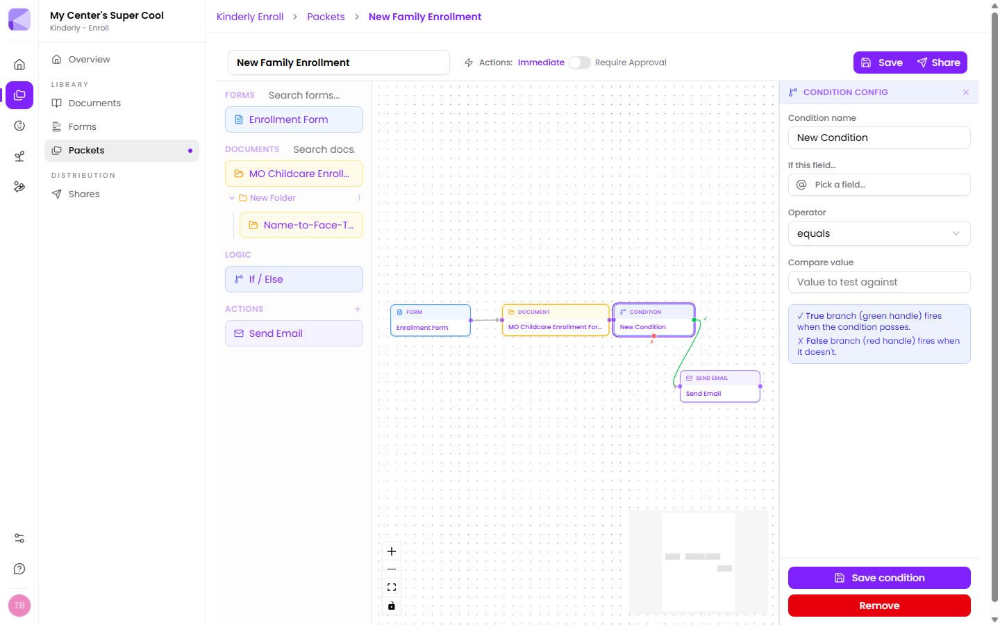

A condition looks at something a family already answered and sends them down one of two paths. Families never see the condition itself — they just get a packet that asks only what's relevant to them.

## Adding one

Drag **If / Else** from the **Logic** section of the palette onto the canvas, then connect the step before it into its left handle.

A condition node has three handles:

- **Left** — the step that feeds into it.
- **Right, green (✓)** — the **true** branch. Taken when the condition passes.
- **Bottom, red (✗)** — the **false** branch. Taken when it doesn't.

## Configuring it

Click the condition node to open **Condition Config**.

- **Condition name** — for your reference on the canvas. Name it after the question it answers: "Has allergies?" beats "New Condition".
- **If this field…** — pick any field from any form earlier in this packet.
- **Operator** — *equals*, *not equals*, *contains*, *not contains*, *greater than*, or *less than*.
- **Compare value** — what to test against.

Click **Save condition**.

:::tip[Name every condition]
Left as "New Condition", a packet with three branches becomes unreadable in a month. The name is the only thing shown on the canvas.
:::

## A worked example

You want families with allergies to complete an extra medical form.

1. On your enrollment form, add a **Choice** field: *"Does your child have any allergies?"* with options Yes / No.
2. In the packet, connect **Enrollment Form → Condition**.
3. Configure it: field *Does your child have any allergies?*, operator **equals**, value **Yes**.
4. Connect the **green** handle to an **Allergy Action Plan** form.
5. Connect the **red** handle to whatever comes next for everyone else.

Families answering Yes get the extra form. Families answering No skip it entirely and never know it existed.

## What families see

The progress bar at the top of a packet is condition-aware:

- Steps that will definitely appear show as solid circles.
- Steps behind a branch show as **dashed** circles — they might appear, depending on answers.
- Once a condition resolves, steps on the path not taken are marked skipped and never shown.

## Things worth knowing

:::caution[Each branch takes one connection]
A condition's green handle and red handle can each feed exactly one next step. To run several things off one branch, point it at a single step and continue the chain from there.
:::

:::tip[Conditions can see every earlier answer]
A condition isn't limited to the form immediately before it — it can test an answer from any earlier form in the packet. So a condition late in a five-step packet can still branch on something answered in step one.
:::

:::tip[Leaving a branch unconnected is a valid ending]
If the false branch has nothing after it, families taking that branch simply finish the packet there. That's a perfectly good way to say "nothing more needed from you".
:::

## Conditions vs. hidden fields

Both hide irrelevant questions, at different scales:

- **[Field visibility](/forms/building-a-form/#show-a-field-only-when-it-matters)** hides *a field* inside one form. Use it for a follow-up question.
- **Conditions** skip *a whole step* in a packet. Use them for an entire form or document that doesn't apply.

One extra question — hide the field. A whole extra form — use a condition.

## Next

- [Approval mode](/packets/approval-mode/) — controlling when actions fire.
- [Building a packet](/packets/building-a-packet/) — the full walkthrough.
