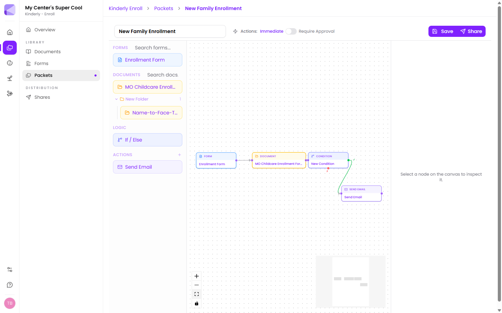

A packet is several steps bundled into one link. Instead of sending a family four separate things and chasing each one, you send a packet — they work through it start to finish, and you get everything back together.

A packet can contain:

- **Forms** — the family fills them in
- **Documents** — the family reads and signs them
- **Logic** — branches the flow based on what they answered
- **Actions** — automations that fire as steps complete

## Why a packet instead of separate shares

| Sending separately | Sending as a packet |
|---|---|
| Four links, four PINs, four emails | One link, one PIN |
| Family can do them out of order, or skip one | Steps unlock in order; nothing gets missed |
| You chase each item individually | One progress view for the whole thing |
| Answers arrive scattered | Everything lands together for review |

:::tip[The rule of thumb]
If two things always go out together, they belong in a packet. Enrollment paperwork, photo consent, and the handbook acknowledgement are never sent apart — so make them one packet, not three shares.
:::

## How steps flow

Nodes are joined left to right by lines. That order is the order the family sees. Each step must be completed before the next unlocks.

Node types are colour-coded on the canvas:

- **Form** (blue) — a form the family completes
- **Document** (amber) — a document to read and sign
- **Condition** (indigo) — a branch; never shown to the family
- **Action** (purple) — an automation; never shown to the family

Conditions and actions happen behind the scenes. The family only ever sees forms and documents.

## Branching

A [condition](/packets/conditions/) checks an earlier answer and sends the family down one of two paths. So a family who answers "yes, my child has allergies" gets an extra medical form, and a family who answers "no" skips straight past it — same packet, different journeys.

## When automations run

The **Actions** toggle at the top of the canvas controls this:

- **Immediate** — actions fire as soon as the step before them is done.
- **Require Approval** — nothing fires until you review the submissions and click Approve.

See [Approval mode](/packets/approval-mode/) for which to choose.

## Next

- [Building a packet](/packets/building-a-packet/) — step by step.
- [Conditions](/packets/conditions/) — branching on answers.
- [Approval mode](/packets/approval-mode/) — controlling when automations run.
