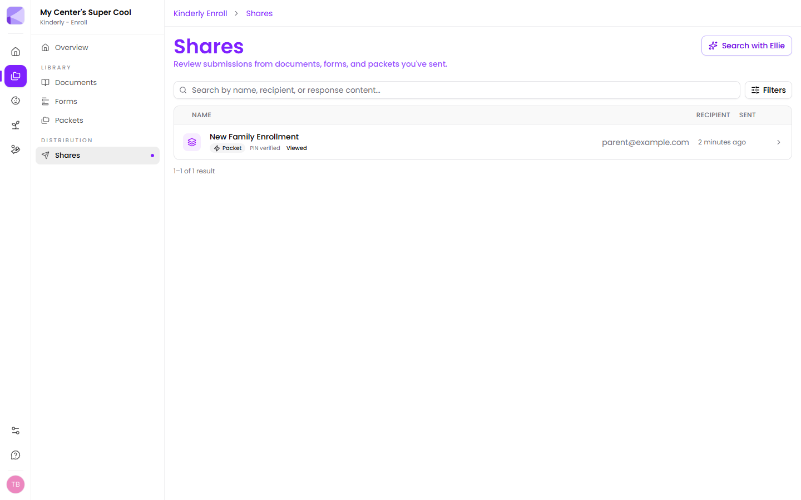
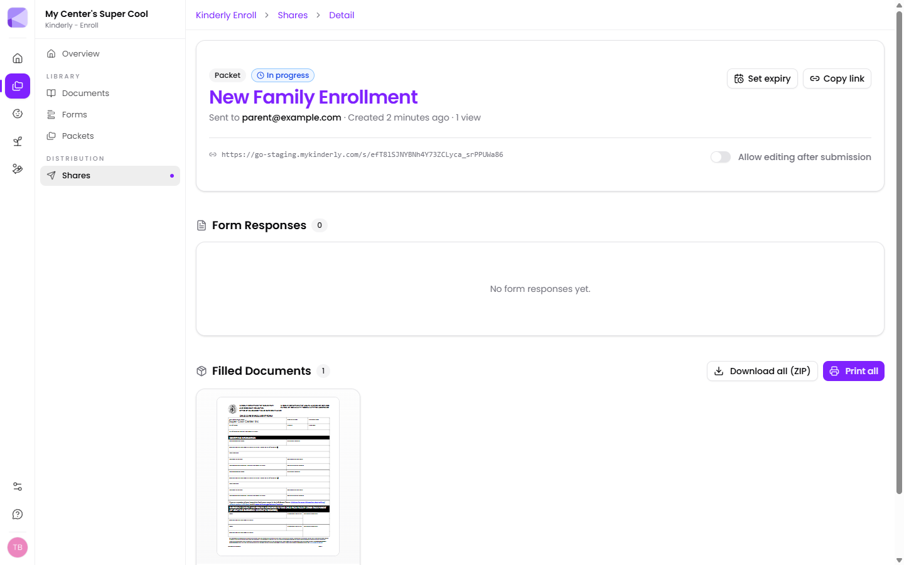

**Enroll → Shares** lists everything you've sent.

Each row shows the name, type, recipient, when it was sent, and status badges:

- **PIN verified** — the recipient got past the PIN gate.
- **Viewed** — they've opened it.
- **In progress** / **Completed** — how far through they are.

## Finding a share

- **Search** — by name, recipient, *or response content*. That last one means you can search for something a family actually typed into a form and find the share it came from.
- **Filters** — narrow by type, status and date.
- **Search with Ellie** — describe what you're after in plain English instead of building a filter.

:::tip[Searching response content is the fastest way to answer "did we ever get X?"]
Rather than opening shares one by one, search for the child's name or an allergy. If it was submitted, it surfaces.
:::

## The detail page

Click a share to open it.

At the top: type and status, the recipient, when it was created, and view count. Plus:

- **Set expiry** — add or change the expiry date after the fact.
- **Copy link** — get the URL again. (The PIN is *not* recoverable — see [Shares overview](/shares/overview/#the-pin).)
- **Allow editing after submission** — toggle this on or off at any time.

### Form Responses

Every form submitted through this share, showing each question with the family's answer. Uploaded images appear as previews.

### Filled Documents

Every document the family signed or completed, as a thumbnail you can open.

- **Download all (ZIP)** — every document in one file, for your records or your licensing folder.
- **Print all** — merges them into a single print job rather than printing one at a time.

:::tip[Print all beats printing individually]
For a packet with four signed documents, **Print all** produces one continuous print job. Printing each one separately is four trips to the printer and four chances to miss a page.
:::

## Approving actions

If the packet is set to [Require Approval](/packets/approval-mode/), a completed share shows a **Needs Approval** badge. Open it, review the submissions, and click **Approve** — every action for that packet fires at once.

Approve is guarded against double-firing, so a stray second click is harmless.

## Revoking a share

Deleting a share kills the link immediately. Anyone holding it gets nothing.

:::caution[Revoking is permanent, and it takes the submissions with it]
Delete the share and you delete its record. If a family has already submitted something you need to keep, download the documents first.
:::

## Housekeeping

:::tip[Set expiries so old links don't pile up]
Every live share is a working door into information about a child. A share created for last September's intake shouldn't still be open. An expiry date closes it for you.
:::

## Next

- [What families see](/shares/for-parents/) — the recipient's side.
- [Approval mode](/packets/approval-mode/) — controlling when actions run.
