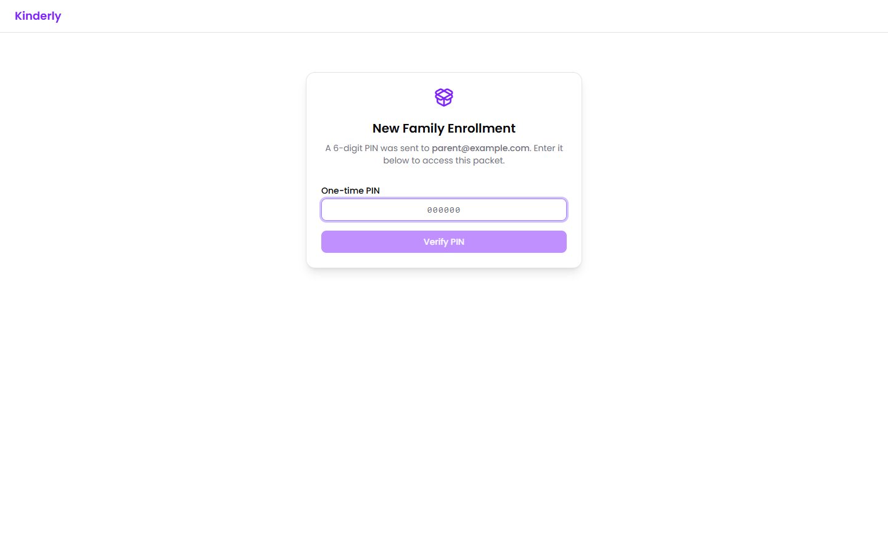
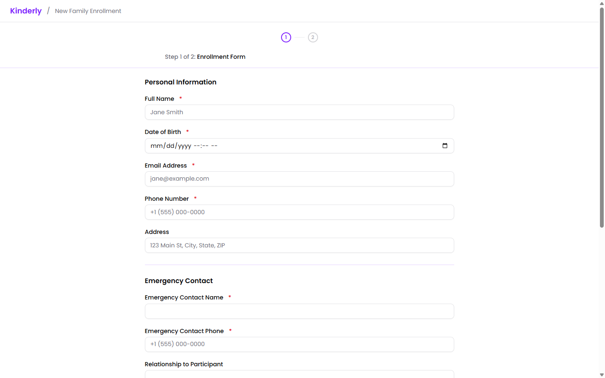

Worth knowing so you can talk a family through it on the phone. You can also point families at this page directly.

## 1. The email

The family gets an email from Kinderly on your center's behalf, subject *"[Your center] shared "…" with you — PIN inside"*. It contains the link, the 6-digit PIN, and the expiry date if you set one.

:::tip[If a family says it never arrived]
Ask them to check spam — it comes from `noreply@mykinderly.com`, not your address. Failing that, open the share and use **Copy link** to send the link yourself. The PIN can't be recovered, so if they don't have that either, create a new share.
:::

## 2. The PIN screen

Opening the link shows a PIN gate.

It confirms the title and which email the PIN went to. They enter the 6 digits and click **Verify PIN**.

:::caution[Five wrong attempts locks it for 30 minutes]
There's no way to unlock it early. If a family gets stuck, the fix is a new share — so it's worth checking they're reading the right email before they burn attempts.
:::

Families sent a **public** link skip this screen entirely.

## 3. Working through the steps

For a packet, they get a progress bar showing where they are.

- The header shows **Step 1 of 2** and the name of the current step.
- Each step must be finished before the next unlocks.
- Conditions and actions are invisible — families only ever see forms and documents.

The progress bar is honest about uncertainty: steps behind a [condition](/packets/conditions/) show as dashed circles, because whether they appear depends on the family's answers. Once a condition resolves, skipped steps are marked as such.

There's a short built-in tutorial the first time, which they can skip.

For a single form or document there's no progress bar — they just fill it in and submit.

## 4. Signing

Documents are signed by drawing with a finger or a mouse. If they make a mess of it, **Undo Signature** (or `Ctrl+Z`) removes the last stroke rather than clearing the whole thing.

## 5. Finishing

When the last step is submitted they get a confirmation screen. Everything appears on your side in [Shares](/shares/admin/).

If you enabled **Allow editing after submission**, they can return via the same link and change their answers. Otherwise the link becomes read-only.

## Answering common questions

**"It says my PIN is wrong."** They're likely using the PIN from a different Kinderly email. Each share has its own.

**"Can I finish this later?"** Yes — completed steps are saved. They come back to the same link and PIN and carry on where they left off.

**"Can I do it on my phone?"** Yes. Forms and signing are built for touch. Documents open at a zoom level meant for a phone screen.

**"I made a mistake after submitting."** If editing is enabled, they can go back and fix it. If not, you'll need to send a fresh share.

## Next

- [Sending a share](/shares/sending/) — the options behind all of this.
- [Managing shares](/shares/admin/) — reviewing what comes back.
