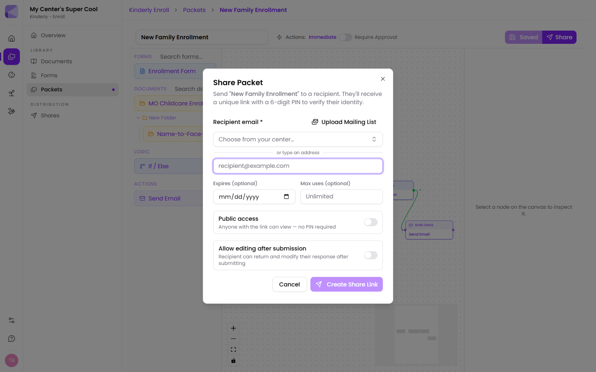
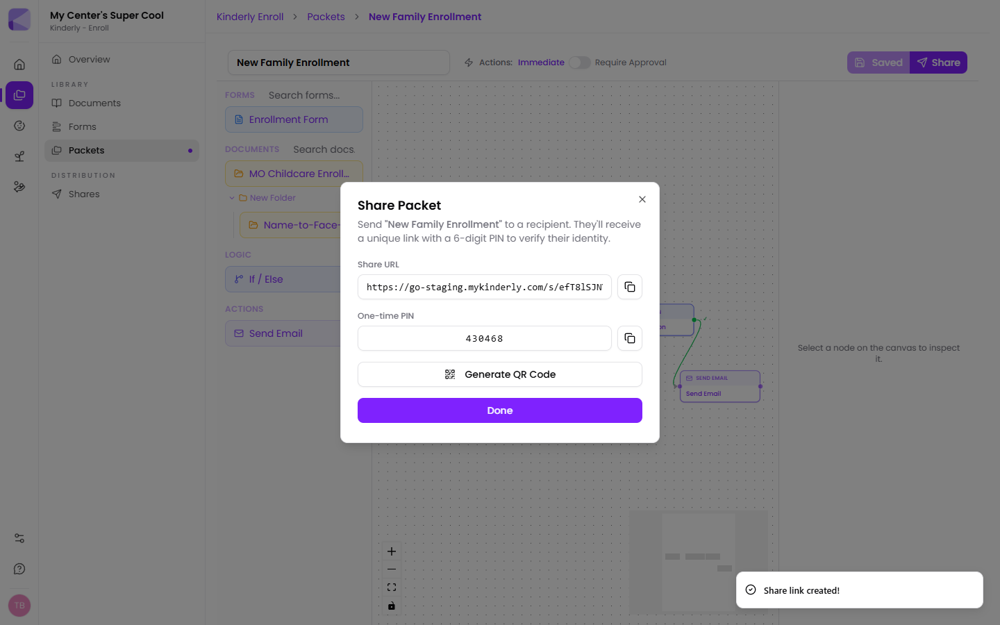
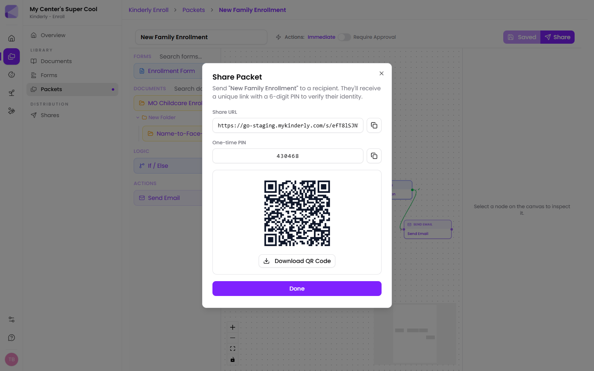

## Creating the share

Open the form, document or packet you want to send and click **Share**.

### Recipient

Two ways to set this:

- **Choose from your center…** — pick an existing guardian from [Manage](/manage/guardians/). Fewer typos, and the share is tied to a person you already have on file.
- **Or type an address** — for anyone not yet in your system, like a prospective family.

There's also **Upload Mailing List**, for sending the same thing to many families at once rather than creating shares one at a time.

:::tip[Pick from your center wherever you can]
A mistyped email is the single most common reason a family "never got the form". Choosing an existing guardian removes that risk, and keeps the share linked to their record.
:::

### Expires (optional)

A date after which the link stops working.

:::tip[Set an expiry on anything time-bound]
Field trip permission for a trip on the 12th shouldn't still be accepting submissions in March. An expiry also gives families a gentle deadline, which gets things back faster.
:::

### Max uses (optional)

How many times the link can be opened. Leave it blank for unlimited.

:::caution[Don't set this too tight]
It's tempting to set max uses to 1 for security. Families routinely open a link, get interrupted, and come back later — and each open counts. If you're going to limit it, leave some headroom.
:::

### Public access

Off by default. Turn it on and the link works with no PIN. See the warning in [Shares overview](/shares/overview/#public-links).

### Allow editing after submission

Off by default. When on, a family can come back and change what they submitted.

- **Leave it off** for anything you'll treat as a signed record.
- **Turn it on** for information that legitimately changes — contact details, a pickup list — where you'd rather they correct it than email you.

This can also be toggled later from the share's detail page.

## Passing on the link

Once created, you get the link and the one-time PIN.

Kinderly has already emailed both to the recipient. The copy buttons are there for when you need to send them another way.

### QR code

**Generate QR Code** turns the link into a scannable code you can download.

:::tip[QR codes are excellent at pickup]
Put the QR code on a sign at the door or on a printed handout. Parents scan it with their phone camera and go straight to the form — no typing a long link, no hunting for the email. It works especially well for open-day enquiry forms and consent slips.
:::

## After sending

The share appears in **Enroll → Shares**. See [Managing shares](/shares/admin/).

## Next

- [Managing shares](/shares/admin/) — reviewing submissions.
- [What families see](/shares/for-parents/) — the recipient's experience.
